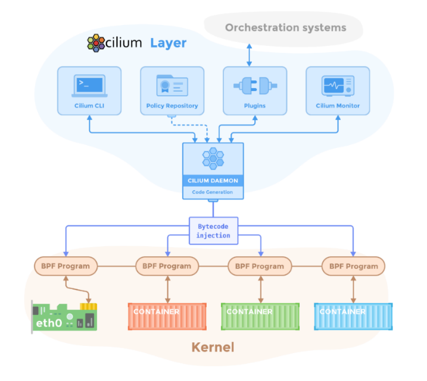
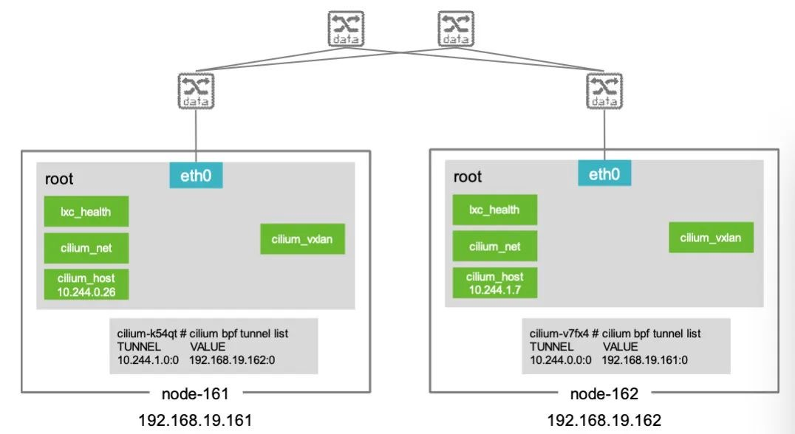
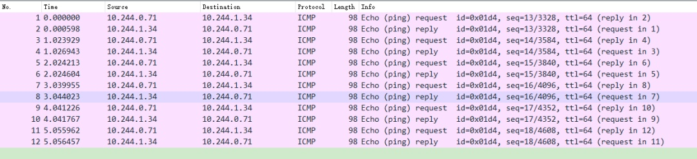
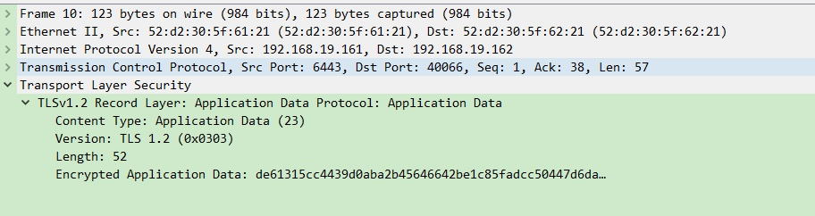
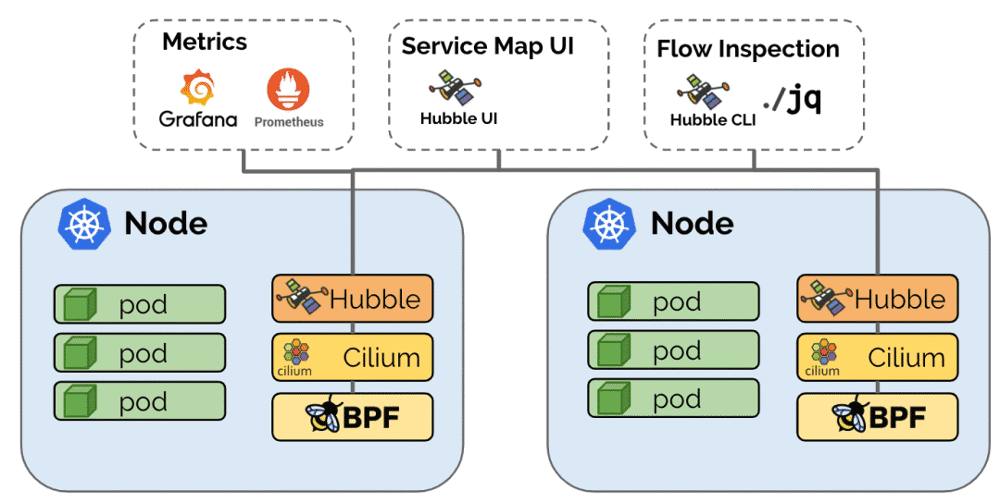
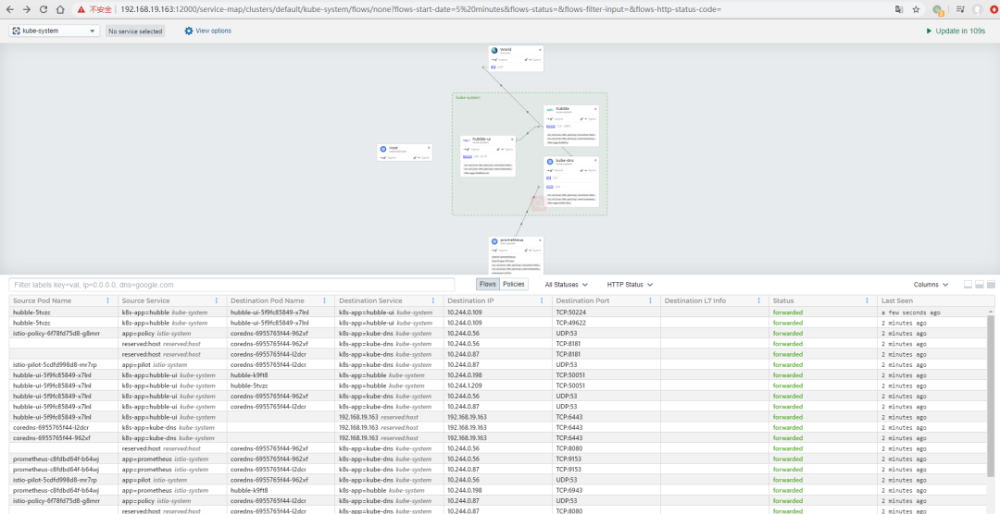
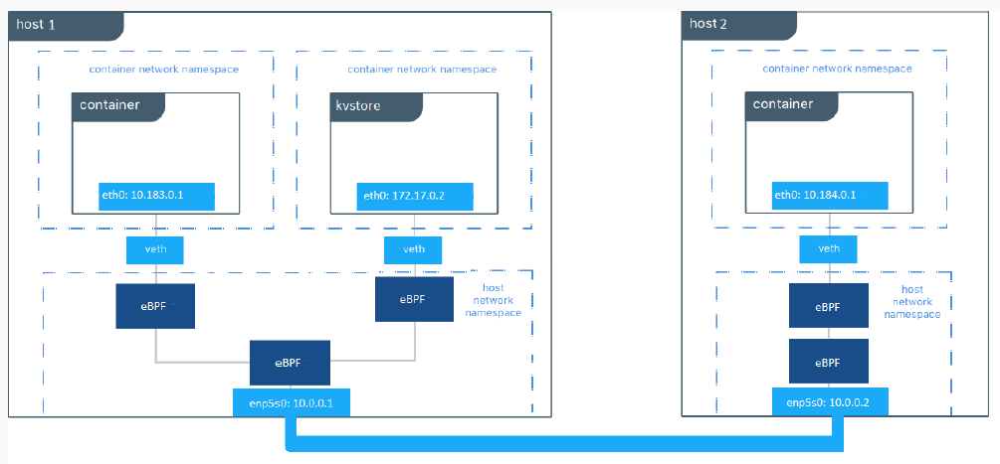
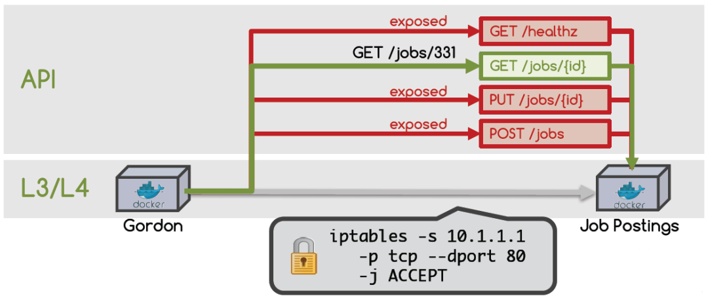

# Cilium网络概述

[toc]

> 原文地址: https://mp.weixin.qq.com/s?__biz=MzIyODYzNTU2OA==&mid=2247488284&idx=1&sn=12436ea0a31daf2b2e463eced3e165dd&scene=21#wechat_redirect

Cilium[1]是一种开源网络实现方案，与其他网络方案不同的是，Cilium着重强调了其在网络安全上的优势，可以透明的对Kubernetes等容器管理平台上的应用程序服务之间的网络连接进行安全防护。

Cilium在设计和实现上，基于Linux的一种新的内核技术eBPF[2]，可以在Linux内部动态插入强大的安全性、可见性和网络控制逻辑，相应的安全策略可以在不修改应用程序代码或容器配置的情况下进行应用和更新。

Cilium在其官网上对产品的定位称为“API-aware Networking and Security”，因此可以看出，其特性主要包括这三方面：

（1）提供Kubernetes中基本的网络互连互通的能力，实现容器集群中包括Pod、Service等在内的基础网络连通功能；

（2）依托eBPF，实现Kubernetes中网络的可观察性以及基本的网络隔离、故障排查等安全策略；

（3）依托eBPF，突破传统主机防火墙仅支持L3、L4微隔离的限制，支持基于API的网络安全过滤能力。Cilium提供了一种简单而有效的方法来定义和执行基于容器/Pod身份（Identity Based）的网络层和应用层（比如HTTP/gRPC/Kafka等）安全策略。

## 一、架构

Cilium官方给出了如下的参考架构[3]，Cilium位于容器编排系统和Linux Kernel之间，向上可以通过编排平台为容器进行网络以及相应的安全配置，向下可以通过在Linux内核挂载eBPF程序，来控制容器网络的转发行为以及安全策略执行。



图1 Cilium架构

在Cilium的架构中，除了Key-Value数据存储之外，主要组件包括Cilium Agent和Cilium Operator，还有一个客户端的命令行工具Cilium CLI。

Cilium Agent作为整个架构中最核心的组件，通过DaemonSet的方式，以特权容器的模式，运行在集群的每个主机上。Cilium Agent作为用户空间守护程序，通过插件与容器运行时和容器编排系统进行交互，进而为本机上的容器进行网络以及安全的相关配置。同时提供了开放的API，供其他组件进行调用。

Cilium Agent在进行网络和安全的相关配置时，采用eBPF程序进行实现。Cilium Agent结合容器标识和相关的策略，生成eBPF程序，并将eBPF程序编译为字节码，将它们传递到Linux内核。


图2 Cilium部署架构

Cilium Operator 主要负责管理集群中的任务，尽可能的保证以集群为单位，而不是单独的以节点为单位进行任务处理。主要包括，通过etcd为节点之间同步资源信息、确保Pod的DNS可以被Cilium管理、集群NetworkPolicy的管理和更新等。

## 二、组网模式

Cilium提供多种组网模式，默认采用基于vxlan的overlay组网。除此之外，还包括：

（1）通过BGP路由的方式，实现集群间Pod的组网和互联；

（2）在AWS的ENI（Elastic Network Interfaces）模式下部署使用Cilium；

（3）Flannel和Cilium的集成部署；

（4）采用基于ipvlan的组网，而不是默认的基于veth；

（5）Cluster Mesh组网，实现跨多个Kubernetes集群的网络连通和安全性

等多种组网模式[4]。

本文将针对默认的基于vxlan的overlay组网，进行深度的原理和数据包路径分析。

## 三、Overlay组网

使用官方给出的yaml文件，通过下述命令，实现Cilium的快速部署。

```bash
1root@u18-161:~# kubectl create -f https://raw.githubusercontent.com/cilium/cilium/v1.6.5/install/kubernetes/quick-install.yaml
```

部署成功后，我们可以发现，在集群的每个主机上，启动了一个Cilium Agent（cilium-k54qt，cilium-v7fx4），整个集群启动了一个Cilium Operator（cilium-operator-cdb4d8bb6-8mj5w）。

```bash
1root@u18-161:~# kubectl get pods --all-namespaces -o wide | grep cilium
2NAMESPACE              NAME                                              READY  STATUS     RESTARTS    AGE           IP                       NODE
4kube-system    cilium-k54qt                                       1/1     Running     0              80d     192.168.19.161    u18-161
5kube-system    cilium-v7fx4                                       1/1     Running     0              80d     192.168.19.162    u18-162
7kube-system    cilium-operator-cdb4d8bb6-8mj5w     1/1    Running     1              80d     192.168.19.162    u18-162       
```

在这种默认的组网情况下，主机上的网络发生了以下变化：在主机的root命名空间，新增了如下图所示的四个虚拟网络接口，其中cilium_vxlan主要是处理对数据包的vxlan隧道操作，采用metadata模式，并不会为这个接口分配ip地址；cilium_host作为主机上该子网的一个网关，并且在node-161为其自动分配了ip地址10.244.0.26/32，cilium_net和cilium_host作为一对veth而创建，还有一个lxc_health。

在每个主机上，可以进入Cilium Agent，查看其隧道配置。比如进入主机node-161上的Cilium Agent cilium-k54qt，运行cilium bpf tunnel list，可以看到，其为集群中的另一台主机node-162（192.168.19.162）上的虚拟网络10.244.1.0创建了一个隧道。同样在node-162上也有一条这样的隧道配置。



图3 Cilium默认overlay组网

接下来创建Pod1和Pod2运行于node-161，Pod3和Pod4运行于node-162。其与主机的root命名空间，通过veth-pair连接，如下图所示。


图4 测试环境组网示例

进入Pod1，可以发现，Cilium已经为其分配了IP地址，并且设置了默认的路由，默认路由指向了本机的cilium_host。初始状态Pod内的arp表为空。

```bash
1root@u18-161:~# kubectl exec -it test-1-7cd5798f46-vzf9s  -n test-1 bash
2root@test-1-7cd5798f46-vzf9s:/# route -n
3Kernel IP routing table
4Destination          Gateway                  Genmask                  Flags       Metric    Ref    Use   Iface
50.0.0.0                10.244.0.26           0.0.0.0                      UG               0            0        0   eth0
610.244.0.26          0.0.0.0                255.255.255.255       UH              0            0        0    eth0
7root@test-1-7cd5798f46-vzf9s:/# arp
8root@test-1-7cd5798f46-vzf9s:/#         
```


在Pod1中ping Pod2，通过抓包可以发现，Pod发出的ARP请求，其对应的ARP响应直接通过其对端的veth-pair 接口返回（52:c6:5e:ef:6e:97和5e:2d:20:9d:b1:a8是Pod1对应的veth-pair）。这个ARP响应是通过Cilium Agent通过挂载的eBPF程序实现的自动应答，并且将veth-pair对端的MAC地址返回，避免了虚拟网络中的ARP广播问题。

```bash
1No.  Time             Source                       Destination         Protocol  Length           Info
2133  39.536478  52:c6:5e:ef:6e:97  5e:2d:20:9d:b1:a8    ARP          42       Who has 10.244.0.26? Tell 10.244.0.71
3134  39.536617  5e:2d:20:9d:b1:a8  52:c6:5e:ef:6e:97    ARP          42       10.244.0.26 is at 5e:2d:20:9d:b1:a8
```

### 3.1**主机内Pod通信**

分析完组网状态之后，那么同一个主机内，两个Pod间通信的情况，就很容易理解了。例如，Pod1向Pod2发包，其数据通路如下图所示Pod1 --> eth0 --> lxc909734ef58f7 --> lxc7c0fcdd49dd0 --> eth0 --> Pod2。


图5 主机内Pod通信路径

### 3.2 **跨主机Pod通信** 

在这种Overlay组网模式下，Pod跨节点之间的通信，通过vxlan实现隧道的封装，其数据路径如下图所示pod1 --> eth0 --> lxc909734ef58f7 --> cilium_vxlan --> eth0(node-161) --> eth0(node-162) --> cilium_vxlan  --> lxc2df34a40a888  --> eth0  --> pod3。


图6 跨主机节点Pod通信路径

我们在cilium_vxlan虚拟网络接口上抓包，如下所示。从抓包分析可以看出，Linux内核将Pod1发出的原始数据包发送到cilium_vxlan进行隧道相关的封包、解包处理，然后再将其送往主机的物理网卡eth0。



图7 cilium_vxlan抓包

在物理网卡eth0抓包可以发现，Pod1出发的数据包经过cilium_vxlan的封装处理之后，其源目的地址已经变成物理主机node-161和node-162，这是经典的overlay封装。同时，还可以发现，cilium_vxlan除了对数据包进行了隧道封装之外，还将原始数据包进行了TLS加密处理，保障了数据包在主机外的物理网络中的安全性。



图8 node-161 eth0抓包

## 四、API感知的安全性

### 4.1**安全可视化与分析** 

Cilium在1.17版本之后，推出并开源了其网络可视化组件Hubble[5]，Hubble是建立在Cilium和eBPF之上，以一种完全透明的方式，提供网络基础设施通信以及应用行为的深度可视化，是一个应用于云原生工作负载，完全分布式的网络和安全可观察性平台。

Hubble能够利用Cilium提供的eBPF数据路径，获得对Kubernetes应用和服务网络流量的深度可见性。这些网络流量信息可以对接Hubble CLI、UI工具，可以通过交互式的方式快速发现诊断相关的网络问题与安全问题。Hubble除了自身的监控工具，还可以对接像Prometheus、Grafana等主流的云原生监控体系，实现可扩展的监控策略。



图9 Hubble架构图

从上图的架构以及Hubble部署可以看出，Hubble在Cilium Agent之上，以DaemonSet的方式运行自己的Agent，笔者这里的部署示例采用Hubble UI来操作和展示相关的网络以及安全数据。

```
1root@u18-163:~# kubectl get pods --all-namespaces -o wide | grep hubble
2kube-system  hubble-5tvzc                           1/1  Running  16  66d  10.244.1.209  u18-164  <none>  <none>
3kube-system  hubble-k9ft8                           1/1  Running  0   34m  10.244.0.198  u18-163  <none>  <none>
4kube-system  hubble-ui-5f9fc85849-x7lnl  1/1  Running  4   67d  10.244.0.109  u18-163  <none>  <none>
```


依托于Hubble深入的对网络数据和行为的可观察性，其可以为网络和安全运维人员提供以下相关能力：

**服务依赖关系和通信映射拓扑：**比如，可以知道哪些服务之间在相互通信？这些服务通信的频率是多少？服务依赖关系图是什么样的？正在进行什么HTTP调用？服务正在消费或生产哪些Kafka的Topic等。

**运行时的网络监控和告警：**比如，可以知道是否有网络通信失败了？为什么通信会失败？是DNS的问题？还是应用程序得问题？还是网络问题？是在第4层(TCP)或第7层(HTTP)的发生的通信中断等；哪些服务在过去5分钟内遇到了DNS解析的问题？哪些服务最近经历了TCP连接中断或看到连接超时?TCP SYN请求的未回答率是多少?等等。

**应用程序的监控：**比如，可以知道针对特定的服务或跨集群服务，HTTP 4xx或者5xx响应码速率是多少？在我的集群中HTTP请求和响应之间的第95和第99百分位延迟是多少?哪些服务的性能最差?两个服务之间的延迟是什么?等等这些问题。

**安全可观察性：**比如，可以知道哪些服务的连接因为网络策略而被阻塞？从集群外部访问了哪些服务？哪些服务解析了特定的DNS名称？等等。



图10 Hubble界面功能

从上图Hubble的界面，我们可以简单的看出其部分功能和数据，比如，可以直观的显示出网路和服务之间的通信关系，可以查看Flows的多种详细数据指标，可以查看对应的安全策略情况，可以通过namespace对观测结果进行过滤等等。

### 4.2 **微隔离** 

默认情况下，Cilium与其他网络插件一样，提供了整个集群网络的完全互联互通，用户需要根据自己的应用服务情况设定相应的安全隔离策略。如下图所示，每当用户新创建一个Pod，或者新增加一条安全策略，Cilium Agent会在主机对应的虚拟网卡驱动加载相应的eBPF程序，实现网络连通以及根据安全策略对数据包进行过滤。比如，可以通过采用下面的NetworkPolicy实现一个基本的L3/L4层网络安全策略。

```yaml
apiVersion: "cilium.io/v2"
kind: CiliumNetworkPolicy
description: "L3-L4 policy to restrict deathstar access to empire ships only"
metadata:
  name: "rule1"
spec:
    endpointSelector:
        matchLabels:
            org: empire
         class: deathstar       
 ingress:
 - fromEndpoints:  
    - matchLabels:
      org: empire
    toPorts:
    - ports:
      - port: "80"
         protocol: TCP       
```




图11 Cilium网络隔离方案示意图

然而，在微服务架构中，一个基于微服务的应用程序通常被分割成一些独立的服务，这些服务通过API（使用HTTP、gRPC、Kafka等轻量级协议）实现彼此的通信。因此，仅实现在L3/L4层的网络安全策略，缺乏对于微服务层的可见性以及对API的细粒度隔离访问控制，在微服务架构中是不够的。

我们可以看如下这个例子，Job Postings这个服务暴露了其服务的健康检查、以及一些增、删、改、查的API。Gordon作为一个求职者，需要访问Job Postings提供的Jobs相关信息。按照传统的L3/L4层的隔离方法，可以通过iptables -s 10.1.1.1 -p tcp –dport 80 -j ACCEPT，允许Gordon来访问Job Postings在80端口提供的HTTP服务。但是这样的网络规则，导致Gordon同样可以访问包括发布信息、修改信息、甚至是删除信息等其他接口。这样的情况肯定是我们的服务设计者所不希望发生的，同时也存在着严重的安全隐患。



图12 L7微隔离示例

因此，实现微服务间的L7层隔离，实现其对应的API级别的访问控制，是微服务网络微隔离的一个重要部分。Cilium在为Docker和Kubernetes等基于Linux的容器框架提供了支持API层面的网络安全过滤能力。通过使用eBPF，Cilium提供了一种简单而有效的方法来定义和执行基于容器/pod身份的网络层和应用层安全策略。我们可以通过采用下面的NetworkPolicy实现一个L7层网络安全策略。


图13 Cilium实现微服务安全

```yaml
 apiVersion: "cilium.io/v2"
 kind: CiliumNetworkPolicy
 description: "L7 policy to restrict access to specific HTTP call"
 metadata:
   name: "rule1"
  spec:
     endpointSelector:
         matchLabels:
          org: empire
         class: deathstar
   ingress:
   - fromEndpoints:
      - matchLabels:
           org: empire
      toPorts:
      - ports:
        - port: "80"
          protocol: TCP
         rules:
             http:
           - method: "POST"
              path: "/v1/request-landing"
```

Cilium还提供了一种基于Proxy的实现方式，可以更方便的对L7协议进行扩展。如下图所示，Cilium Agent采用eBPF实现对数据包的重定向，将需要进行过滤的数据包首先转发至Proxy代理，Proxy代理根据其相应的过滤规则，对收到的数据包进行过滤，然后再将其发回至数据包的原始路径，而Proxy代理进行过滤的规则，则通过Cilium Agent进行下发和管理。

当需要扩展协议时，只需要在Proxy代理中，增加对新协议的处理解析逻辑以及规则处置逻辑，即可实现相应的过滤能力。


图14 L7层访问控制协议扩展原理图

## 五、总结

Cilium是一个基于eBPF和XDP的高性能网络方案，本文着重介绍了其原理以及默认的overlay组网通信。除了基本的网络通信能力外，Cilium还包含了基于eBPF的负载均衡能力，L3/L4/L7的安全策略能力等相关的内容，后续会进行更详细的实践分析。


## 参考文献        

------

[1] https://cilium.io

[2] https://mp.weixin.qq.com/s/pPDO4NpDoIblh4taJXVuzw

[3] https://cilium.readthedocs.io/en/stable/concepts/overview/

[4] https://cilium.readthedocs.io/en/stable/gettingstarted/#advanced-networking

[5] https://cilium.io/blog/2019/11/19/announcing-hubble/