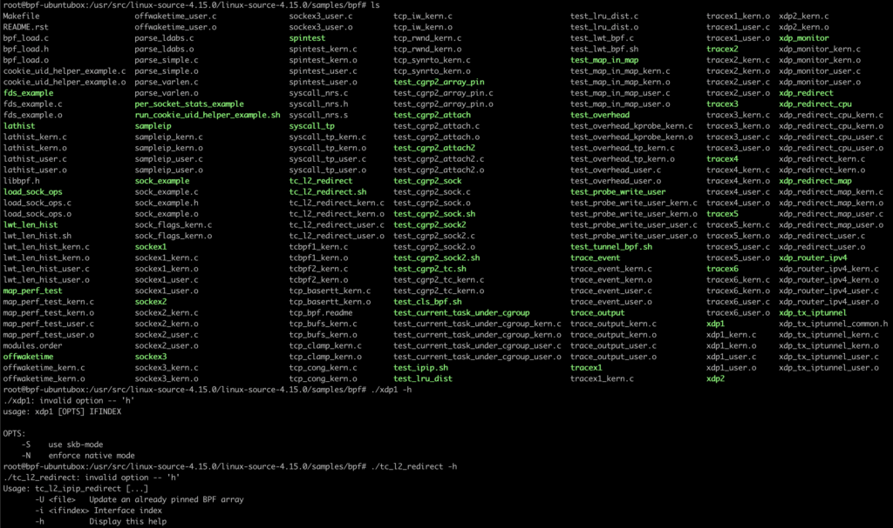

## TL;DR
声明：下文提到的`bpf/BPF`字样是泛指，包括`cBPF`和`eBPF`。

通过文章，你能了解Linux内核代码中关于bpf程序的编译运行机制，并能学会如何基于Linux内核bpf示例环境编写你自己的bpf程序。文章涉及的实验环境和代码可以到这个git repo获取：
[https://github.com/nevermosby/linux-bpf-learning](https://github.com/nevermosby/linux-bpf-learning
)

最近Kubecon 2020 China上已经有了3个关于bpf的中文分享（来自腾讯和PingCAP），也看到国内第一梯队公司越来越关心bpf这项新技术，欢迎大家都能加入bpf学习队伍。

## 内核源码里的BPF示例代码概述
示例代码里基本是**kern**和**user**成对出现，也就是对于一个示例来说，分别提供了在内核空间运行的和用户空间运行的程序，绝对是良心之作了。

## 下载Linux内核源代码
First thing first，第一步是下载内核代码。

### 选择内核版本
目前社区维护的内核版本繁多，你需要确定下载哪个版本的代码。个人建议是下载与你的操作系统运行一致的内核版本，避免后续编译时出现不兼容问题。

### 选择下载渠道
代码下载渠道也很多：
1. 通过Linux社区官方仓库下载。以下几个网站都是官方维护的：
	- [https://github.com/torvalds/linux](https://github.com/torvalds/linux)
	- [https://git.kernel.org/pub/scm/linux/kernel/git/torvalds/linux.git](https://git.kernel.org/pub/scm/linux/kernel/git/torvalds/linux.git)
	观察下来，只要有新的commit，基本是实时同步的，下载最新版本的内核代码肯定没问题。如果你跟我一样，需要相对较旧的版本，只要切换相关的目标tag即可。我的内核版本是**v4.15.0**，下载地址参考如下：
    	- [https://github.com/torvalds/linux/tree/v4.15](https://github.com/torvalds/linux/tree/v4.15)
    	- [https://git.kernel.org/pub/scm/linux/kernel/git/torvalds/linux.git/tag/?h=v4.15](https://git.kernel.org/pub/scm/linux/kernel/git/torvalds/linux.git/tag/?h=v4.15)
2. 通过Ubuntu apt仓库下载。Ubuntu官方自己维护了每个操作系统版本的背后的Linux内核代码，可以通过以下两种apt命令方式获取相关代码：
    
    ```bash
    # 第一种方式
    # 先搜索
    > apt-cache search linux-source
    linux-source - Linux kernel source with Ubuntu patches
    linux-source-4.15.0 - Linux kernel source for version 4.15.0 with Ubuntu patches
    linux-source-4.18.0 - Linux kernel source for version 4.18.0 with Ubuntu patches
    linux-source-5.0.0 - Linux kernel source for version 5.0.0 with Ubuntu patches
    linux-source-5.3.0 - Linux kernel source for version 5.3.0 with Ubuntu patches
    # 再安装
    > apt install linux-source-4.15.0

    # 第二种方式
    > apt-get source linux
    Reading package lists... Done
    NOTICE: 'linux' packaging is maintained in the 'Git' version control system at:
    git://git.launchpad.net/~ubuntu-kernel/ubuntu/+source/linux/+git/bionic
    Please use:
    git clone git://git.launchpad.net/~ubuntu-kernel/ubuntu/+source/linux/+git/bionic
    to retrieve the latest (possibly unreleased) updates to the package.
    Need to get 167 MB of source archives.
    Get:2 https://mirrors.ustc.edu.cn/ubuntu bionic-updates/main linux 4.15.0-99.100 (tar) [158 MB]
    ......

    # 以上两种方式，内核源代码均下载至/usr/src/目录下
    ```

下载完成后，BPF示例就在**源码根目录/samples/bpf**目录下，可以到[这里](https://elixir.bootlin.com/linux/v4.15/source/samples/bpf)看个在线版的，建议大家通读一遍这个目录下的[README.rst](https://elixir.bootlin.com/linux/v4.15/source/samples/bpf/README.rst)，了解整体步骤。


## 编译BPF示例代码

### 安装编译所依赖的工具
在真正开始编译工作之前，请确保你的实验环境已经安装`clang`和`llvm`：
- clang >= version 3.4.0
- llvm >= version 3.7.1

### 正式编译示例代码
万事俱备了，可以正式开始编译工作。我们说的“编译”其本质就是利用内核目录下不同的`Makefile`，通过特定的`make`指令完成特定工作。来，先上命令：

```bash
# 切换到内核源代码根目录
cd linux_sourcecode/
# 生成内核编译时需要的头文件
make headers_install
# 可视化选择你想为内核添加的内核模块，最终生成保存了相关模块信息的.config文件，为执行后面的命令做准备
make menuconfig
# 使用make命令编译samples/bpf/目录下所有bpf示例代码，注意需要加上最后的/符号
make samples/bpf/ # or  make M=samples/bpf
    
```

如下截图看结果，生成了一大堆的文件，有`.o`后缀的目标文件，还有绿色高亮的可执行文件，挑两个执行下，效果符合期待。



## 分析**samples/bpf/Makefile**文件
如果你是个喜欢打破砂锅问到底的同学，可以跟我一起看看最后的make命令到底用了什么魔法？当然你也可以跳过这个章节。本次分析的Makefile是基于内核版本[v4.15.0](https://elixir.bootlin.com/linux/v4.15/source/samples/bpf/Makefile)，不同内核版本的Makefile内容会有差异，但总体逻辑是一致的。

### 前提条件
- 如果你对`make`作为构建工具还不熟悉，可以看看这个[教程](http://www.ruanyifeng.com/blog/2015/02/make.html)。
- Linux内核中大部分Makefile都是基于[Kernel Build System](https://www.kernel.org/doc/html/latest/kbuild/index.html)，简称`kbuild`，它是对Makefile的扩展，使其在编译内核文件时更加高效、简洁。因此你需要对其有所了解，可以到[这里](https://www.kernel.org/doc/html/latest/kbuild/makefiles.html)看看官方介绍。
- 上文使用的另外两个**make**命令，利用的是根目录下的[`Makefile`](https://elixir.bootlin.com/linux/v4.15/source/Makefile)，完成“生成头文件”和“生成.config文件”，这两步是内核开发的必要步骤，感兴趣的同学移步看[README.rst](https://elixir.bootlin.com/linux/v4.15/source/Documentation/admin-guide/README.rst)。

### 分段分析
- 第一段关于变量`hostprogs-y`
  
  ```bash
  # List of programs to build
  hostprogs-y := test_lru_dist
  hostprogs-y += sock_example
  hostprogs-y += fds_example
  hostprogs-y += sockex1
  hostprogs-y += sockex2
  hostprogs-y += sockex3
  ...
  ```

  Makefile的第一段是初始化变量`hostprogs-y`，乍一看，好像是把所有示例程序名称都赋值给了`hostprogs-y`。官方的注释是**List of programs to build**，直译过来是，“准备构建的程序清单”、，大致能猜出这个变量的意义了，通过查询官方文档，发现一个概念叫[**Host Program support**](https://www.kernel.org/doc/html/latest/kbuild/makefiles.html#host-program-support)，意思是在编译阶段就构建出可以在本机直接运行的可执行文件，为了实现这个目的，需要经过两个步骤：
    1. 第一步告诉 **kbuild** 需要生成哪些可执行文件，这个就是通过变量`hostprogs-y`来指定。来看源码中的这一行：
        
        ```bash
        hostprogs-y := test_lru_dist
        ```

        程序`test_lru_dist`就是一个被指定的可执行程序名称，`kbuild`默认会去同一个目录下查找名为`test_lru_dist.c`作为构建这个可执行文件的源文件。类似代码也是同样的意义，总计有41个可执行文件赋值给了变量`hostprogs-y`中。
    2. 第二步是将显式依赖关系添加到可执行文件中。这可以通过两种方式来完成，一种是为Makefile中某个**target**添加这个可执行文件，作为**prerequisites**，形成依赖关系，这样就可以触发这个可执行文件的构建任务，另一种是直接利用变量 `always`，即无需指定第一种方式中的依赖关系，只要Makefile被执行，变量`always`中包含的可执行文件都会被构建。来看源码中的相关片段：
   
        ```bash
        # Tell kbuild to always build the programs
		always := $(hostprogs-y)
        ```

        可以看到它使用上文提到的第二种方式，保证这些可执行文件一定会被执行构建任务。
- 第二段关于变量`<executeable>-objs`
  
  ```bash
  # Libbpf dependencies
  LIBBPF := ../../tools/lib/bpf/bpf.o
  CGROUP_HELPERS := ../../tools/testing/selftests/bpf/cgroup_helpers.o

  test_lru_dist-objs := test_lru_dist.o $(LIBBPF)
  sock_example-objs := sock_example.o $(LIBBPF)
  fds_example-objs := bpf_load.o $(LIBBPF) fds_example.o
  sockex1-objs := bpf_load.o $(LIBBPF) sockex1_user.o
  sockex2-objs := bpf_load.o $(LIBBPF) sockex2_user.o
  sockex3-objs := bpf_load.o $(LIBBPF) sockex3_user.o
  ...
  ```

  第一、二行是声明并初始化了两个变量`LIBBPF`和`CGROUP_HELPERS`，以便后续复用。后面的几行是有共性的，`:=`符号左边是个有规律的变量：`<executeable>-objs`，右边是多个.o文件，看上去的意义像是右边的多个文件会合并成一个指定文件。通过查询文档可知，可执行文件可以由多个其他文件复合组成，通过`<executeable>-objs`这样的语法，可以列出并指定所有用于生成最终可执行文件（命名为`executeable`）的文件清单。以如下代码为例，可执行文件`sockex1`是由`bpf_load.o`、`bpf.o`和`sockex1_usr.o`链接生成的。

  ```bash
  sockex1-objs := bpf_load.o $(LIBBPF) sockex1_user.o
  ```

- 第三段关于变量`HOSTCFLAGS`和`HOSTLOADLIBES`
  
  ```bash
  HOSTCFLAGS += -I$(objtree)/usr/include
  HOSTCFLAGS += -I$(srctree)/tools/lib/
  HOSTCFLAGS += -I$(srctree)/tools/testing/selftests/bpf/
  HOSTCFLAGS += -I$(srctree)/tools/lib/ -I$(srctree)/tools/include
  HOSTCFLAGS += -I$(srctree)/tools/perf

  HOSTCFLAGS_bpf_load.o += -I$(objtree)/usr/include -Wno-unused-variable
  HOSTLOADLIBES_fds_example += -lelf
  HOSTLOADLIBES_sockex1 += -lelf
  HOSTLOADLIBES_sockex2 += -lelf
  HOSTLOADLIBES_sockex3 += -lelf
  ...
  HOSTLOADLIBES_tracex4 += -lelf -lrt
  ...
  ```

  上面的代码中有两个关键变量：
    1. 变量`HOSTCFLAGS`顾名思义，它是在编译host program（即可执行文件）时，为**编译**操作指定的特殊选项，如上面代码中使用`-I`参数指定依赖的头文件所在目录。默认情况下，这个变量的配置会作用到当前Makefile涉及的所有host program。如果你想为某个host program单独指定一个编译选项，可以像上文的这行代码：
        ```bash
        HOSTCFLAGS_bpf_load.o += -I$(objtree)/usr/include -Wno-unused-variable
        ```
        只为`bpf_load.o`这个object文件指定特殊选项。
    2. 变量`HOSTLOADLIBES`是用于**链接**（link）操作时指定的特殊选项，如上面代码中使用两个library（因为代码中使用了相关的函数），通过选项`-l`加到最终生成的可执行文件中：
        - `libelf`，这个库用来管理elf格式的文件，bpf程序一般都会使用elf作为最终格式，因此需要加载这个library。
		- `librt`，这个库其实很常用，一般含有`#include<time.h>`头文件的代码，都需要加载这个library，用来支持real time相关功能。
- 第四段关于如何编译BPF程序源文件
  
  ```bash
  # Trick to allow make to be run from this directory
  all:
	  $(MAKE) -C ../../ $(CURDIR)/
	
  ...
  $(obj)/%.o: $(src)/%.c
      $(CLANG) $(NOSTDINC_FLAGS) $(LINUXINCLUDE) $(EXTRA_CFLAGS) -I$(obj) \
				-I$(srctree)/tools/testing/selftests/bpf/ \
				-D__KERNEL__ -Wno-unused-value -Wno-pointer-sign \
				-D__TARGET_ARCH_$(ARCH) -Wno-compare-distinct-pointer-types \
				-Wno-gnu-variable-sized-type-not-at-end \
				-Wno-address-of-packed-member -Wno-tautological-compare \
				-Wno-unknown-warning-option $(CLANG_ARCH_ARGS) \
				-O2 -emit-llvm -c $< -o -| $(LLC) -march=bpf -filetype=obj -o $@
  ```

  其中有两个系统变量：第一个`$@`代表的是target所指的文件名；第二个`$<`代表的是第一个prerequisite的文件名。看过本站关于BPF博文的同学可能已经看出如上代码的玄机了，我把它简化下：
  
  ```bash
  clang -I $(srctree)/tools/testing/selftests/bpf/ \ 
		      -O2 -emit-llvm -c $< -o -| \ 
		      llc -march=bpf -filetype=obj -o $@
  ```

  从上面的简化版命令，可以看出最后一行make命令的本质，就是把所有.c源代码文件，通过clang全部编译成.o目标文件。

### 小结
对**samples/bpf/Makefile**这个文件执行make命令的本质就是：
1. 为运行在内核空间的示例源代码（一般文件名称后缀为**kern.c**），编译生成.o后缀的目标文件，以便加载到对应BPF提供的hook中去。
2. 为运行在用户空间的示例源代码(一般文件文件后缀为**user.c**)，编译生成可以在本机直接运行的可执行文件，以便用户可以直接运行测试。

## 我在执行Make命令遇到的问题
我自己的实验环境是Ubuntu 18.04 with 4.15.0内核，在执行上面的make命令时，发生了以下的错误信息：

```bash
...
In file included from ./tools/perf/perf-sys.h:9:0,
            	 from samples/bpf/bpf_load.c:28:
./tools/perf/perf-sys.h: In function ‘sys_perf_event_open’:
./tools/perf/perf-sys.h:68:15: error: ‘test_attr__enabled’ undeclared (first use in this function)
  if (unlikely(test_attr__enabled))
        	   ^
./tools/include/linux/compiler.h:74:43: note: in definition of macro ‘unlikely’
 # define unlikely(x)  __builtin_expect(!!(x), 0)
                                    	   ^
./tools/perf/perf-sys.h:68:15: note: each undeclared identifier is reported only once for each function it appears in
  if (unlikely(test_attr__enabled))
        	   ^
./tools/include/linux/compiler.h:74:43: note: in definition of macro ‘unlikely’
 # define unlikely(x)  __builtin_expect(!!(x), 0)
                                    	   ^
In file included from samples/bpf/bpf_load.c:28:0:
./tools/perf/perf-sys.h:69:3: warning: implicit declaration of function ‘test_attr__open’ [-Wimplicit-function-declaration]
   test_attr__open(attr, pid, cpu, fd, group_fd, flags);
   ^~~~~~~~~~~~~~~
scripts/Makefile.host:107: recipe for target 'samples/bpf/bpf_load.o' failed
make[1]: *** [samples/bpf/bpf_load.o] Error 1
Makefile:1823: recipe for target 'samples/bpf/' failed
make: *** [samples/bpf/] Error 2
```

根据错误信息，查看发生错误的文件为**./tools/perf/perf-sys.h**，报错的那一行是test开头的。通过Google发现了内核大佬们的邮件来往：[https://www.spinics.net/lists/netdev/msg608676.html](https://www.spinics.net/lists/netdev/msg608676.html)。大佬们建议由于是测试相关的代码，所以可以skip掉。修改完的文件在[这里](https://github.com/nevermosby/linux-bpf-learning/blob/master/bpf/perf-sys.h)，请斟酌参考。重新运行make命令，错误不再发生了。

```bash
make samples/bpf/ # and it works
```

## 编译运行自己的BPF程序
如果你想利用Linux内核环境来编译自己的BPF程序，是非常方便的。只要对`samples/bpf/`目录下的[`Makefile`](https://elixir.bootlin.com/linux/v4.15/source/samples/bpf/Makefile)进行一点点自定义改造即可，如果你仔细阅读了上面的分析，那么改造的原理就显而易见了：

```bash
# 假设你自己BPF程序如下所示：
# 内核空间代码：my_bpf_101_kern.c
# 用户空间代码：my_bpf_101_user.c

# 从上之下，添加新的代码行
 
# 1. 追加新的一行至hostprogs-y开头的代码块最后，保证自己的BPF程序能够生成可执行文件
hostprogs-y += my_bpf_101

# 2. 一般BPF程序使用以下命令即可，具体取决于你的程序是否依赖其他特殊头文件
my_bpf_101-objs := bpf_load.o $(LIBBPF) my_bpf_101_user.o

# 3. 追加新的一行至always开头的代码块最后，保证触发生成可执行文件的任务
always += my_bpf_101_kern.o
```

一般的BPF程序只需要通过如上3处更新加入到Makefile中，就可以使用`make samples/bpf/`命令，生成你自己程序的可执行文件了。
