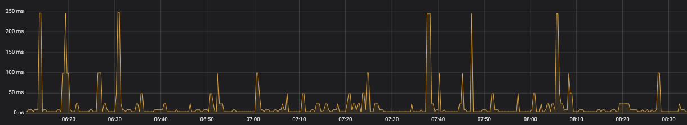
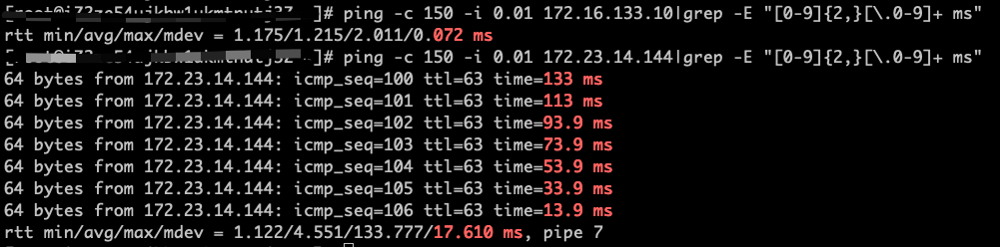
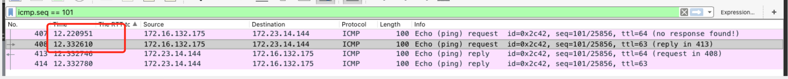
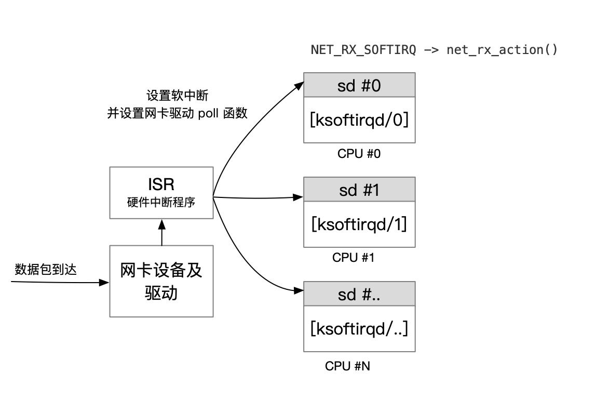
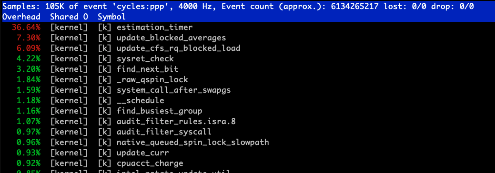
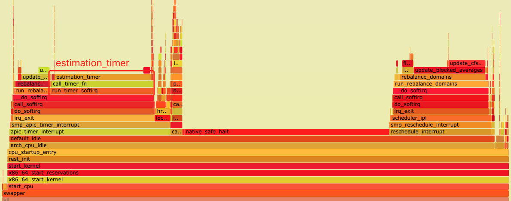
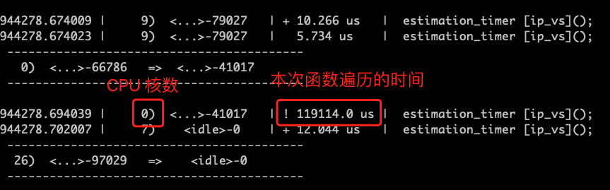
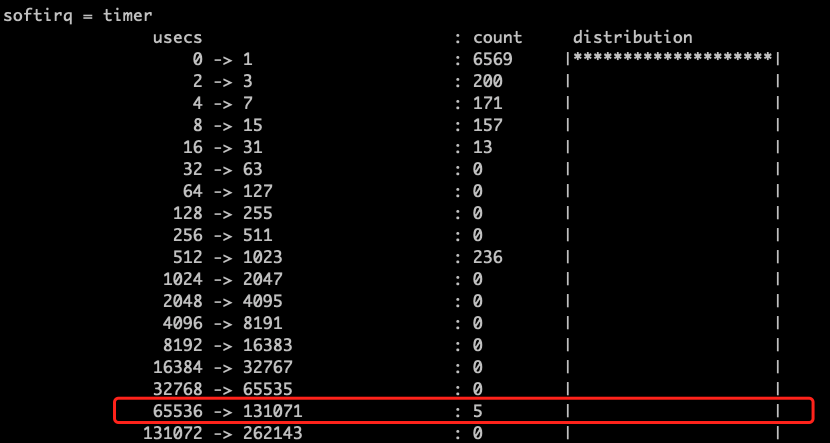

## 1. 前言

趣头条的容器化已经开展了一年有余，累计完成了近 1000 个服务的容器化工作，微服务集群的规模也达到了千台以上的规模。随着容器化服务数量和集群规模的不断增大，除了常规的 API Server 参数优化、Scheduler 优化等常规优化外，近期我们还碰到了 kubernetes 底层负载均衡 ipvs 模块导致的网络抖动问题，在此把整个问题的分析、排查和解决的思路进行总结，希望能为有类似问题场景解决提供一种思路。

涉及到的 k8s 集群和机器操作系统版本如下：

* k8s 阿里云 ACK 14.8 版本，网络模型为 CNI 插件  [terway](https://github.com/AliyunContainerService/terway) 中的  terway-eniip 模式；
* 操作系统为 CentOS 7.7.1908，内核版本为 3.10.0-1062.9.1.el7.x86_64；

## 2. 网络抖动问题

在容器集群中新部署的服务 A，在测试初期发现通过服务注册发现访问下游服务 B（在同一个容器集群） 调用延时 999  线偶发抖动，测试 QPS 比较小，从业务监控上看起来比较明显，最大的延时可以达到 200 ms。



图 2-1 服务调用延时

服务间的访问通过 gRPC 接口访问，节点发现基于 consul 的服务注册发现。通过在服务 A 容器内的抓包分析和排查，经过了以下分析和排查：

* 服务 B 部分异常注册节点，排除异常节点后抖动情况依然存在；

* HTTP 接口延时测试， 抖动情况没有改善；

* 服务 A 在 VM（ECS）上部署测试，抖动情况没有改善；

经过上述的对比测试，我们逐步把范围缩小至服务 B 所在的主机上的底层网络抖动。

经过多次 ping 包测试，我们寻找到了某台主机  A 与 主机 B 两者之间的 ping 延时抖动与服务调用延时抖动规律比较一致，由于 ping 包 的分析比 gRPC 的分析更加简单直接，因此我们将目标转移至底层网络的 ping 包测试的轨道上。

能够稳定复现的主机环境如下图，通过主机 A ping 主机 B 中的容器实例 172.23.14.144 实例存在 ping 延时抖动。

```bash
# 主机 B 中的 Pod IP 地址
# ip route|grep 172.23.14.144
172.23.14.144 dev cali95f3fd83a87 scope link
```

![ping_host_container] (imgs/ping_host_container.png)

图 2-2 ping 测试涉及到的主机和容器拓扑图

基于主机B 网络 eth1 和容器网络 cali-xxx 进行 ping 的对比结果如图：



图 2-3 ping 主机与容器网络详情

通过多次测试我们发现至 Node 主机 B 主机网络的 ping 未有抖动，容器网络 cali-xx 存在比较大的抖动，最高达到 133 ms。

在 ping 测试过程中分别在主机 A 和主机 B 上使用 tcpdump 抓包分析，发现在主机 B 上的 eth1 与网卡 cali95f3fd83a87 之间的延时达 133 ms。



图 2-4 主机 B 上的 ping 包延时

到此为止问题已经逐步明确，在主机 B 上接收到 ping 包在转发过程中有 100 多ms 的延时，那么是什么原因导致的 ping 数据包在主机 B转发的延时呢？

## 3. 问题分析

在分析 ping 数据包转发延时的情况之前，我们首先简单回顾一下网络数据包在内核中工作机制和数据流转路径。

### 3.1 网络数据包内核中的处理流程

在内核中，网络设备驱动是通过中断的方式来接受和处理数据包。当网卡设备上有数据到达的时候，会触发一个硬件中断来通知 CPU 来处理数据，此类处理中断的程序一般称作 ISR (Interrupt Service Routines)。ISR 程序不宜处理过多逻辑，否则会它设备的中断处理无法及时响应。因此 Linux 中将中断处理函数分为上半部和下半部。上半部是只进行最简单的工作，快速处理然后释放 CPU。剩下将绝大部分的工作都放到下半部中，下半部中逻辑有内核线程选择合适时机进行处理。

Linux 2.4 以后内核版本采用的下半部实现方式是软中断，由 ksoftirqd 内核线程全权处理， 正常情况下每个 CPU 核上都有自己的软中断处理数队列和  `ksoftirqd` 内核线程。软中断实现只是通过给内存中设置一个对应的二进制值来标识，软中断处理的时机主要为以下 2 种：

* 硬件中断 `irq_exit`退出时；
* 被唤醒 `ksoftirqd`  内核线程进行处理软中断；

常见的软中断类型如下：

```c
enum{
    HI_SOFTIRQ=0,
    TIMER_SOFTIRQ,
    NET_TX_SOFTIRQ,  // 网络数据包发送软中断
    NET_RX_SOFTIRQ,  // 网络数据包接受软中断
		//... 
};
```

代码 3-1 Linux 软中断类型

优先级自上而下，HI_SOFTIRQ 的优先级最高。其中 `NET_TX_SOFTIRQ` 对应于网络数据包的发送， `NET_RX_SOFTIRQ`  对应于网络数据包接受，两者共同完成网络数据包的发送和接收。

网络相关的中断程序在网络子系统初始化的时候进行注册， `NET_RX_SOFTIRQ` 的对应函数为 `net_rx_action()` ，在 `net_rx_action()`  函数中会调用网卡设备设置的 `poll` 函数，批量收取网络数据包并调用上层注册的协议函数进行处理，如果是为 ip 协议，则会调用 `ip_rcv`，上层协议为 icmp 的话，继续调用 `icmp_rcv` 函数进行后续的处理。



图 3-1 网卡设备数据包接收示意图

```c
//net/core/dev.c

static int __init net_dev_init(void){

    ......
    for_each_possible_cpu(i) {
         struct softnet_data *sd = &per_cpu(softnet_data, i);

        memset(sd, 0, sizeof(*sd));
        skb_queue_head_init(&sd->input_pkt_queue);
        skb_queue_head_init(&sd->process_queue);
        sd->completion_queue = NULL;
        INIT_LIST_HEAD(&sd->poll_list);   // 软中断的处理中的 poll 函数列表
        // ......
    }
    ......
    open_softirq(NET_TX_SOFTIRQ, net_tx_action); // 注册网络数据包发送的软中断
    open_softirq(NET_RX_SOFTIRQ, net_rx_action); // 注册网络数据包接受的软中断
}

subsys_initcall(net_dev_init);
```

代码 3-2  软中断数据及网络软中断注册

网络数据的收发的延时，多数场景下都会和系统软中断处理相关，这里我们将重点分析 ping 包抖动时的软中断情况。这里我们采用基于 [BCC](https://github.com/iovisor/bcc) 的 [**traceicmpsoftirq.py**](https://gist.github.com/DavadDi/62ee75228f03631c845c51af292c2b17) 来协助定位 ping 包处理的内核情况。

> BCC 为 Linux 内核 BPF 技术的前端程序，主要提供 Python 语言的绑定，`traceicmpsoftirq.py`  脚本依赖于 BCC 库，需要先安装 BCC 项目，各操作系统安装参见 [INSTALL.md](https://github.com/iovisor/bcc/blob/master/INSTALL.md)。
>
>  `traceicmpsoftirq.py` 脚本在 Linux 3.10 内核与 Linux 4.x 内核上的读写方式有差异，需要根据内核略有调整。

使用 `traceicmpsoftirq.py` 在主机 B 上运行，我们发现出现抖动延时的时内核运行的内核线程都为 `ksoftirqd/0`。

```bash
#主机 主机 A#A
# ping -c 150 -i 0.01  172.23.14.144 |grep -E "[0-9]{2,}[\.0-9]+ ms"

# 主机 B
# ./traceicmpsoftirq.py
tgid    pid     comm            icmp_seq
...
0       0       swapper/0       128
6       6       ksoftirqd/0     129
6       6       ksoftirqd/0     130
...
```

代码 3-3   `traceicmpsoftirq.py` ping 主机 B 容器 IP 抖动时的详情

`[ksoftirqd/0]` 这个给了我们两个重要的信息：

* 从主机 A ping 主机 B 中容器 IP 的地址，每次处理包的处理都会固定落到 CPU#0 上；
* 出现延时的时候该 CPU#0 都在运行软中断处理内核线程 `ksoftirqd/0`，即在处理软中断的过程中调用的数据包处理，软中断另外一种处理时机如上所述 `irq_exit` 硬中断退出时；

如果 ping 主机 B 中的容器 IP 地址落在 CPU#0 核上，那么按照我们的测试过程， ping 主机 B 的宿主机 IP 地址没有抖动，那么处理的 CPU 一定不在 #0 号上，才能符合测试场景，我们继续使用主机 B 主机 IP 地址进行测试：

```bash
# 主机 A
# ping -c 150 -i 0.01  172.23.14.144 |grep -E "[0-9]{2,}[\.0-9]+ ms"

# 主机 B
# ./traceicmpsoftirq.py
tgid    pid     comm            icmp_seq
...
0       0       swapper/19      55
0       0       swapper/19      56
0       0       swapper/19      57
...
```

代码 3-4  `traceicmpsoftirq.py` ping 主机 B 主机 IP 详情

通过实际的测试验证，ping 主机 B 宿主机 IP 地址时候，全部都落在了 CPU#19 上。问题排查至此处，我们可以断定是 CPU#0 与 CPU#19 在软中断处理的负载上存在差异，但是此处我们有带来另外一个疑问，为什么我们的 ping 包的处理总是固定落到同一个 CPU 核上呢？ 通过查询资料和主机配置确认，主机上默认启用了 RPS 的技术。RPS 全称是 Receive Packet Steering，这是 Google 工程师 Tom Herbert 提交的内核补丁, 在 2.6.35 进入 Linux 内核，采用软件模拟的方式，实现了多队列网卡所提供的功能，分散了在多 CPU 系统上数据接收时的负载，把软中断分到各个CPU处理，而不需要硬件支持，大大提高了网络性能。简单点讲，就是在软中断的处理函数 `net_rx_action()` 中依据 RPS 的配置，使用接收到的数据包头部（比如源 IP 地址端口等信息）信息进行作为 key 进行 Hash 到对应的 CPU 核上去处理，算法具体参见 [get_rps_cpu](https://elixir.bootlin.com/linux/v5.8/source/net/core/dev.c#L4305) 函数。

Linux 环境下的 RPS 配置，可以通过下面的命令检查：

```bash
# cat /sys/class/net/*/queues/rx-*/rps_cpus
```

通过对上述情况的综合分析，我们把问题定位在 CPU#0 在内核线程中对于软中断处理的问题上。

### 3.2 CPU 软中断处理排查

问题排查到这里，我们将重点开始排查 CPU#0 上的 CPU 内核态的性能指标，看看是否有运行的函数导致了软中断处理的延期。

首先我们使用 `perf` 命令对于 CPU#0  进行内核态使用情况进行分析。

```bash
# perf top -C 0 -U
```



图 3-2 perf top CPU#0 内核性能数据

通过 `perf top` 命令我们注意到 CPU#0 的内核态中，`estimation_timer` 这个函数的使用率一直占用比较高，同样我们通过对于 CPU#0 上的火焰图分析，也基本与 `perf top` 的结果一致。



图 3-3 `estimation_timer` 在内核 CPU#0 上的火焰图

为了弄清楚 `estimation_timer` 的内核占用情况，我们继续使用 开源项目 [perf-tools](https://github.com/brendangregg/perf-tools)（作者为 Brendan Gregg）中的 [funcgraph](https://github.com/brendangregg/perf-tools/blob/master/bin/funcgraph) 工具分析函数 `estimation_timer` 在内核中的调用关系图和占用延时。

```bash
# -m 1最大堆栈为 1 层，-a 显示全部信息  -d 6 跟踪 6秒
#./funcgraph -m 1 -a -d 6 estimation_timer
```



图 3-4 `estimation_timer` 函数在内核函数调用

同时我们注意到 `estimation_timer` 函数在 CPU#0 内核中的遍历一次遍历时间为 119 ms，在内核处理软中断的情况中占用过长的时间，这一定会影响到其他软中断的处理。

为了进一步确认 CPU#0 上的软中断处理情况，我们基于 BCC 项目中的 [softirqs.py](https://github.com/iovisor/bcc/blob/master/tools/softirqs.py) 脚本（本地略有修改），观察 CPU#0 上的软中断数量变化和整体耗时分布，发现 CPU#0 上的软中断数量增长并不是太快，但是 timer 的直方图却又异常点数据， 通过 timer 在持续 10s 内的 timer 数据分析，我们发现执行的时长分布在 [65 - 130] ms区间的记录有 5 条。这个结论完全与通过 `funcgraph` 工具抓取到的 `estimation_timer` 在 CPU#0 上的延时一致。。

```bash
# -d 采用直方图  10 表示 10s 做一次聚合， 1 显示一次  -C 0 为我们自己修改的功能，用于过滤 CPU#0 
# /usr/share/bcc/tools/softirqs -d  10 1 -C 0
```



图 3-5 CPU#0 软中断之 timer 的执行时长直方图

通过上述分析我们得知 `estimation_timer` 来自于 ipvs 模块（参见图 3-4），kubernets 中 kube-proxy 组件负载均衡器正是基于 ipvs 模块，那么问题基本上出现在 kube-proxy 进程上。

我们在主机 B 上仅保留测试的容器实例，在停止 kubelet 服务后，手工停止 kube-proxy 容器进程，经过重新测试，ping 延时抖动的问题果然消失了。

到此问题的根源我们可以确定是 kube-proxy 中使用的 ipvs 内核模块中的 `estimation_timer` 函数执行时间过长，导致网络软中断处理延迟，从而使 ping 包的出现抖动，那么 `estimation_timer[ipvs]` 的作用是什么？ 什么情况下导致的该函数执行如此之长呢？

### 3.3 ipvs estimation_timer 定时器

谜底终将揭晓！

我们通过阅读 ipvs 相关的源码，发现 `estimation_timer()[ipvs]` 函数针对每个 Network Namespace 创建时候的通过 [ip_vs_core.c](https://elixir.bootlin.com/linux/v5.8/source/net/netfilter/ipvs/ip_vs_core.c#L2469) 中的 `__ip_vs_init` 初始化的，

```c
/*
 *	Initialize IP Virtual Server netns mem.
 */
static int __net_init __ip_vs_init(struct net *net)
{
	struct netns_ipvs *ipvs;
  // ...
	if (ip_vs_estimator_net_init(ipvs) < 0)  // 初始化
		goto estimator_fail;
}
```

代码 3-5 ipvs 初始化函数

`ip_vs_estimator_net_init` 函数在文件 [ip_vs_est.c](https://elixir.bootlin.com/linux/v5.8/source/net/netfilter/ipvs/ip_vs_est.c#L187) 中，定义如下： 

```c
int __net_init ip_vs_estimator_net_init(struct netns_ipvs *ipvs)
{
	INIT_LIST_HEAD(&ipvs->est_list);
	spin_lock_init(&ipvs->est_lock);
	timer_setup(&ipvs->est_timer, estimation_timer, 0);  // 设置定时器函数 estimation_timer 
	mod_timer(&ipvs->est_timer, jiffies + 2 * HZ);       // 启动第一次计时器，2秒启动 
	return 0;
}
```

代码 3-6 ipvs estimator 初始化函数

`estimation_timer` 也定义在 [ip_vs_est.c](https://elixir.bootlin.com/linux/v5.8/source/net/netfilter/ipvs/ip_vs_est.c#L96) 文件中。

```c
static void estimation_timer(struct timer_list *t)
{
  // ...
	spin_lock(&ipvs->est_lock);
	list_for_each_entry(e, &ipvs->est_list, list) {
		s = container_of(e, struct ip_vs_stats, est);

		spin_lock(&s->lock);
		ip_vs_read_cpu_stats(&s->kstats, s->cpustats);

		/* scaled by 2^10, but divided 2 seconds */
		rate = (s->kstats.conns - e->last_conns) << 9;
		e->last_conns = s->kstats.conns;
		e->cps += ((s64)rate - (s64)e->cps) >> 2;
    
    // ...
	}
	spin_unlock(&ipvs->est_lock);
	mod_timer(&ipvs->est_timer, jiffies + 2*HZ);  // 2 秒后启动新的一轮统计
}
```

代码 3-7 ipvs estimation_timer 函数

从 `estimation_timer` 的函数实现来看，会首先调用 spin_lock 进行锁的操作，然后遍历当前 Network Namespace 下的全部 ipvs 规则。由于我们集群的某些历史原因导致生产集群中的 Service 比较多，因此导致一次遍历的时候会占用比较长的时间。

该函数的统计最终体现在 `ipvsadm  --stat` 的结果中（Conns   InPkts  OutPkts  InBytes OutBytes）：

```bash
# ipvsadm -Ln --stats
IP Virtual Server version 1.2.1 (size=4096)
Prot LocalAddress:Port               Conns   InPkts  OutPkts  InBytes OutBytes  # 相关统计
  -> RemoteAddress:Port
TCP  10.85.0.10:9153                     0        0        0        0        0
  -> 172.22.34.187:9153                  0        0        0        0        0
```

 对于我们集群中的 `ipvs` 规则进行统计，我们发现大概在 30000 左右。

```bash
# ipvsadm -Ln --stats|wc -l
```

既然每个 Network Namespace 下都会有 `estimation_timer` 的遍历，为什么只有 CPU#0 上的规则如此多呢？

这是因为只有主机的 Host Network Namespace 中才会有全部的 ipvs 规则，这个我们也可以通过 `ipvsadm -Ln` (执行在 Host Network Namespace 下) 验证。从现象来看，CPU#0  是 ipvs 模块加载的时候用于处理宿主机 Host Network Namespace  中的 ipvs 规则，当然这个核的加载完全是随机的。

## 4. 问题解决

### 4.1 解决方案

到此，问题已经彻底定位，由于我们服务早期部署的历史原因，短期内调整 Service 的数目会导致大量的迁移工作，中间还有云厂商 SLB 产生的大量规则，也没有办法彻底根除，单从技术上解决的话，我们可以采用的方式有以下 3 种：

1. 动态感知到宿主机  Network Namespace 中 ipvs `estimation_timer`  函数的函数，在 RPS 中设置关闭该 CPU 映射；

   该方式需要调整 RPS 的配置，而且 ipvs 处理主机 Network Namespace 的核数不固定，需要识别并调整配置，还需要处理重启时候的 ipvs  主机 Network Namespace  的变动；

2. 由于我们不需要 ipvs 这种统计的功能，可以通过修改 ipvs 驱动的方式来规避该问题；

   修改 ipvs 的驱动模块，需要重新加载该内核模块，也会导致主机服务上的短暂中断；

3.  ipvs 模块将内核遍历统计调整成一个独立的内核线程进行统计；

   ipvs 规则在内核 timer 中遍历是 ipvs 移植到 k8s 上场景未适配的问题，社区应该需要把在 timer 中的遍历独立出去，但是这个方案需要社区的推动解决，远水解不了近渴。

通过上述 3 种方案的对比，解决我们当前抖动的问题都不太容易实施，为了保证生产环境的稳定和实施的难易程度，最终我们把眼光定位在 Linux Kernel 热修的 [kpatch](https://github.com/dynup/kpatch) 方案上， kpath 实现的 livepatch 功能可以实时为正在运行的内核提供功能增强，无需重新启动系统。

### 4.2 kpatch livepatch 

Kpatch 是给 Linux 内核 livepatch 的工具，由 Redhat 公司出品。最早出现的打热补丁工具是 Ksplice。但是 Ksplice 被 Oracle 收购后，一些发行版生产商就不得不开发自己的热补丁工具，分别是 Redhat 的 Kpatch 和 Suse 的 KGraft。同时，在这两家厂商的推进下，kernel 4.0 开始，开始集成了 livepatch 技术。 Kpatch 虽然是 Redhat 研发，但其也支持 Ubuntu、Debian、Oracle Linux 等的发行版。

这里我们简单同步一下实施的步骤，更多的文档可以从 kpath 项目中获取。 

#### 4.2.1 获取 kpath 编译和安装

```bash
$ git clone https://github.com/dynup/kpatch.git
$ source test/integration/lib.sh
# 中间会使用 yum 安装相关的依赖包，安装时间视网络情况而定，在阿里云的环境下需要的时间比较长
$ sudo kpatch_dependencies
$ cd kpatch 

# 进行编译
$ make

# 默认安装到 /usr/local，需要注意 kpatch-build 在目录 /usr/local/bin/ 下，而 kpatch 在 /usr/local/sbin/ 目录
$ sudo make install
```

#### 4.2.2 生成内核源码 patch

在 kpatch 的使用过程中，需要使用到内核的源码，源码拉取的方式可以参考这里[我需要内核的源代码](https://wiki.centos.org/zh/HowTos/I_need_the_Kernel_Source?highlight=(kernel)|(src))。

```bash
$ rpm2cpio kernel-3.10.0-1062.9.1.el7.src.rpm |cpio -div 
$ xz -d linux-3.10.0-1062.9.1.el7.tar.xz 
$ tar -xvf linux-3.10.0-1062.9.1.el7.tar
$ cp -ra linux-3.10.0-1062.9.1.el7/ linux-3.10.0-1062.9.1.el7-patch
```

此处我们将  `estimation_timer ` 函数的实现设置为空

```c
static void estimation_timer(unsigned long arg)
{
    printk("hotfix estimation_timer patched\n");
    return;
}
```

并生成对应的 patch 文件

```bash
# diff -u linux-3.10.0-1062.9.1.el7/net/netfilter/ipvs/ip_vs_est.c linux-3.10.0-1062.9.1.el7-patch/net/netfilter/ipvs/ip_vs_est.c > ip_vs_timer_v1.patch
```

#### 4.2.3 生产内核补丁并 livepatch

然后生成相关的 patch ko 文件并应用到内核：

```bash
# /usr/local/bin/kpatch-build ip_vs_timer_v1.patch --skip-gcc-check --skip-cleanup -r /root/kernel-3.10.0-1062.9.1.el7.src.rpm

# 编译成功后会在当前目录生成 livepatch-ip_vs_timer_v1.ko 文件
# 应用到内核中.

# /usr/local/sbin/kpatch load livepatch-ip_vs_timer_v1.ko
```

通过内核日志查看确认

```bash
$ dmesg -T
[Thu Dec  3 19:50:50 2020] livepatch: enabling patch 'livepatch_ip_vs_timer_v1'
[Thu Dec  3 19:50:50 2020] livepatch: 'livepatch_ip_vs_timer_v1': starting patching transition
[Thu Dec  3 19:50:50 2020] hotfix estimation_timer patched
```

至此通过我们的 livepatch 成功修订了 `estimation_timer` 的调用，一切看起来很成功。然后通过 `funcgraph` 工具查看 `estimation_timer` 函数不再出现在调用关系中。

> 如果仅仅把函数设置为空的实现，等于是关闭了  `estimation_timer`  的调用，即使通过命令 unload 掉 livepatch，该函数的也不会恢复，因此在生产环境中建议将函数的 2s 调用设置成个可以接受的时间范围内，比如 5 分钟，这样在 unload 以后，可以在 5 分钟以后恢复 `estimation_timer` 的继续调用。

### 4.3 使用 kpatch 注意事项

* kpatch 是基于内核版本生成的 ko 内核模块，必须保证后续 livepatch 的内核版本与编译机器的内核完全一致。

* 通过手工 livepatch 的方式修复，如果保证机器在重启以后仍然生效需要通过 `install` 来启用 kpathc 服务进行保证。

```bash
# /usr/local/sbin/kpatch install livepatch-ip_vs_timer_v1.ko
# systemctl start kpatch
```

* 在其他的机器上进行 livepatch 需要文件`kpatch`、`livepatch-ip_vs_timer_v1.ko` 和 `kpatch.service`（用于 install 后重启生效） 3 个文件即可。 

##  5. 总结

网络抖动问题的排查，涉及应用层、网络协议栈和内核中运作机制等多方面的协调，排查过程中需要逐层排查、逐步缩小范围，在整个过程中，合适的工具至关重要，在我们本次问题的排查过程中， BPF 技术为我们排查的方向起到了至关重要的作用。BPF 技术的出现为我们观测和跟踪内核中的事件，提供了更加灵活的数据采集和数据分析的能力，在生产环境中我们已经将其广泛用于了监控网络底层的重传和抖动等维度，极大提升提升我们在偶发场景下的问题排查效率，希望更多的人能够从 BPF 技术中受益。


