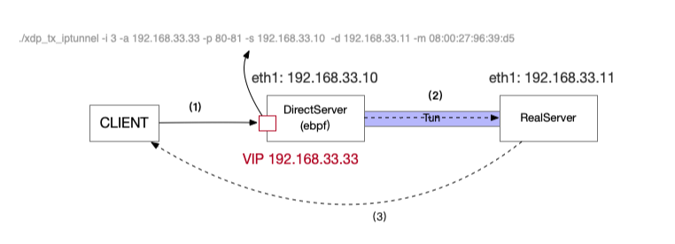

# Facebook L4 LB katran

[TOC]

## ipip 测试

文章参考：https://developers.redhat.com/blog/2019/05/17/an-introduction-to-linux-virtual-interfaces-tunnels/

两台机器测试 172.15.111.120 和 172.15.111.125

在 125 机器上设置

```bash
# ip link add ipip01 type ipip local 172.25.111.125  remote 172.25.111.120
# ip link set ipip01 up
# ip addr add 10.10.1.1/24 dev ipip01
```

在 120 机器上设置

```bash
# ip link add ipip01 type ipip local 172.25.111.120  remote 172.25.111.125
# ip link set ipip01 up
# ip addr add 10.10.1.2/24 dev ipip01
```

在 120 机器上 ping 

```bash
# ping 10.10.1.1 -c1
PING 10.10.1.1 (10.10.1.1) 56(84) bytes of data.
64 bytes from 10.10.1.1: icmp_seq=1 ttl=64 time=0.235 ms

--- 10.10.1.1 ping statistics ---
1 packets transmitted, 1 received, 0% packet loss, time 0ms
rtt min/avg/max/mdev = 0.235/0.235/0.235/0.000 ms
```

在 eth0 网卡上抓包

```bash
# tcpdump -ni eth0  proto 4 or proto 41
tcpdump: verbose output suppressed, use -v or -vv for full protocol decode
listening on eth0, link-type EN10MB (Ethernet), capture size 262144 bytes
15:00:39.861463 IP 172.25.111.120 > 172.25.111.125: IP 10.10.1.2 > 10.10.1.1: ICMP echo request, id 18771, seq 1, length 64 (ipip-proto-4)
15:00:39.861685 IP 172.25.111.125 > 172.25.111.120: IP 10.10.1.1 > 10.10.1.2: ICMP echo reply, id 18771, seq 1, length 64 (ipip-proto-4)
```

完整报文参见： ipip-120-all.pcap


## bpf iptunnel ex



编译 BPF 程序：

```bash
# 下载 kernel 源码
$ cd /data
$ wget https://github.com/torvalds/linux/archive/v4.18-rc8.zip
$ unzip  v4.18-rc8.zip
$ cd linux-4.18-rc8
$ make headers_install
$ make menuconfig

# 注意需要加上最后的/符号 或者make M=samples/bpf
$ make samples/bpf/ 

$ cd samples/bpf/ && ls -hl|grep  xdp_tx
-rwxr-xr-x. 1 root    root    146K Aug 25 11:05 xdp_tx_iptunnel
-rw-r--r--. 1 root    root     634 Aug  5  2018 xdp_tx_iptunnel_common.h
-rw-r--r--. 1 root    root    6.4K Aug 26 03:47 xdp_tx_iptunnel_kern.c
-rw-r--r--. 1 root    root    5.0K Aug 26 03:47 xdp_tx_iptunnel_kern.o
-rw-r--r--. 1 root    root    6.4K Aug 25 10:45 xdp_tx_iptunnel_user.c
-rw-r--r--. 1 root    root     12K Aug 25 11:05 xdp_tx_iptunnel_user.o
```


LVS TUN 配置参看： https://wsgzao.github.io/post/lvs-tun/

### RealServer 配置和脚本

192.168.33.11  mac:  08:00:27:969:d5， VIP 192.168.33.33

```bash
# cat /etc/init.d/lvs-tun
#!/bin/sh
#
# Startup script handle the initialisation of LVS
# chkconfig: - 28 72
# description: Initialise the Linux Virtual Server for TUN
#
### BEGIN INIT INFO
# Provides: ipvsadm
# Required-Start: $local_fs $network $named
# Required-Stop: $local_fs $remote_fs $network
# Short-Description: Initialise the Linux Virtual Server
# Description: The Linux Virtual Server is a highly scalable and highly
#   available server built on a cluster of real servers, with the load
#   balancer running on Linux.
# description: start LVS of TUN-RIP
LOCK=/var/lock/ipvsadm.lock
VIP=192.168.33.33
. /etc/rc.d/init.d/functions
start() {
     PID=`ifconfig | grep tunl0 | wc -l`
     if [ $PID -ne 0 ];
     then
         echo "The LVS-TUN-RIP Server is already running !"
     else
         #Load the tun mod
         /sbin/modprobe tun
         /sbin/modprobe ipip
         #Set the tun Virtual IP Address
         /sbin/ifconfig tunl0 $VIP netmask 255.255.255.255 broadcast $VIP up
         /sbin/route add -host $VIP dev tunl0
         echo "1" >/proc/sys/net/ipv4/conf/tunl0/arp_ignore
         echo "2" >/proc/sys/net/ipv4/conf/tunl0/arp_announce
         echo "1" >/proc/sys/net/ipv4/conf/all/arp_ignore
         echo "2" >/proc/sys/net/ipv4/conf/all/arp_announce
         echo "0" > /proc/sys/net/ipv4/conf/tunl0/rp_filter
         echo "0" > /proc/sys/net/ipv4/conf/all/rp_filter
         /bin/touch $LOCK
         echo "starting LVS-TUN-RIP server is ok !"
     fi
}

stop() {
         /sbin/ifconfig tunl0 down
         echo "0" >/proc/sys/net/ipv4/conf/tunl0/arp_ignore
         echo "0" >/proc/sys/net/ipv4/conf/tunl0/arp_announce
         echo "0" >/proc/sys/net/ipv4/conf/all/arp_ignore
         echo "0" >/proc/sys/net/ipv4/conf/all/arp_announce
         #Remove the tun mod
         /sbin/modprobe -r tun
         /sbin/modprobe -r ipip
         rm -rf $LOCK
         echo "stopping LVS-TUN-RIP server is ok !"
}

status() {
     if [ -e $LOCK ];
     then
        echo "The LVS-TUN-RIP Server is already running !"
     else
        echo "The LVS-TUN-RIP Server is not running !"
     fi
}

case "$1" in
  start)
        start
        ;;
  stop)
        stop
        ;;
  restart)
        stop
        start
        ;;
  status)
        status
        ;;
  *)
        echo "Usage: $1 {start|stop|restart|status}"
        exit 1
esac
exit 0
```

启动 nginx 和 tun 服务，并使用 vip 地址测试

```bash
# yum install nginx -y
# service nginx start
# echo "rs1" > /usr/share/nginx/html/index.html

# service lvs-tun start
# curl -v  192.168.33.33
rs1
```

RealServer 上的 IP 地址信息列表：

```bash
# ip addr
1: lo: <LOOPBACK,UP,LOWER_UP> mtu 65536 qdisc noqueue state UNKNOWN group default qlen 1
    link/loopback 00:00:00:00:00:00 brd 00:00:00:00:00:00
    inet 127.0.0.1/8 scope host lo
       valid_lft forever preferred_lft forever
    inet6 ::1/128 scope host
       valid_lft forever preferred_lft forever
2: eth0: <BROADCAST,MULTICAST,UP,LOWER_UP> mtu 1500 qdisc fq_codel state UP group default qlen 1000
    link/ether 52:54:00:0a:c8:40 brd ff:ff:ff:ff:ff:ff
    inet 10.0.2.15/24 brd 10.0.2.255 scope global dynamic eth0
       valid_lft 84011sec preferred_lft 84011sec
    inet6 fe80::5054:ff:fe0a:c840/64 scope link
       valid_lft forever preferred_lft forever
3: eth1: <BROADCAST,MULTICAST,UP,LOWER_UP> mtu 1500 qdisc fq_codel state UP group default qlen 1000
    link/ether 08:00:27:96:39:d5 brd ff:ff:ff:ff:ff:ff
    inet 192.168.33.11/24 brd 192.168.33.255 scope global eth1
       valid_lft forever preferred_lft forever
    inet6 fe80::a00:27ff:fe96:39d5/64 scope link
       valid_lft forever preferred_lft forever
6: tunl0@NONE: <NOARP,UP,LOWER_UP> mtu 1480 qdisc noqueue state UNKNOWN group default qlen 1
    link/ipip 0.0.0.0 brd 0.0.0.0
    inet 192.168.33.33/32 brd 192.168.33.33 scope global tunl0
       valid_lft forever preferred_lft forever
```


### DirectorServer 配置

在启动 BPF 程序测试之前，我们可以先使用原生的 LVS 程序进行验证，脚本内容如下：

```bash
# cat ds.sh
#!/bin/sh
# Startup script handle the initialisation of LVS
# chkconfig: - 28 72
# description: Initialise the Linux Virtual Server for TUN
#
### BEGIN INIT INFO
# Provides: ipvsadm
# Required-Start: $local_fs $network $named
# Required-Stop: $local_fs $remote_fs $network
# Short-Description: Initialise the Linux Virtual Server
# Description: The Linux Virtual Server is a highly scalable and highly
#   available server built on a cluster of real servers, with the load
#   balancer running on Linux.
# description: start LVS of TUN
LOCK=/var/lock/lvs-tun.lock
VIP=192.168.33.33
RIP1=192.168.33.11
. /etc/rc.d/init.d/functions

start()    {
     PID=`ipvsadm -Ln | grep ${VIP} | wc -l`
     if    [ $PID -gt 0 ];

     then
           echo "The LVS-TUN Server is already running !"
     else
           #Load the tun mod
           /sbin/modprobe tun
           /sbin/modprobe ipip
           #Set the tun Virtual IP Address
           /sbin/ifconfig tunl0 $VIP broadcast $VIP netmask 255.255.255.255 up
           /sbin/route add -host $VIP dev tunl0
           #Clear IPVS Table
           /sbin/ipvsadm -C
           #The icmp recruit setting
           echo "0" >/proc/sys/net/ipv4/ip_forward
           echo "0" >/proc/sys/net/ipv4/conf/all/send_redirects
           echo "0" >/proc/sys/net/ipv4/conf/default/send_redirects
           #Set Lvs
           /sbin/ipvsadm -At $VIP:80 -s rr
           /sbin/ipvsadm -at $VIP:80 -r $RIP1:80 -i  -w 1
           /bin/touch $LOCK
           #Run Lvs
           echo "starting LVS-TUN-DIR Server is ok !"
     fi
}

stop()    {
           #stop  Lvs server
           /sbin/ipvsadm -C
           /sbin/ifconfig tunl0 down >/dev/null
           #Remove the tun mod
           /sbin/modprobe -r tun
           /sbin/modprobe -r ipip
           rm -rf $LOCK
           echo "stopping LVS-TUN-DIR server is ok !"
}

status()  {
     if [ -e $LOCK ];
     then
         echo "The LVS-TUN Server is already running !"
     else
         echo "The LVS-TUN Server is not running !"
     fi
}

case "$1" in
  start)
        start
        ;;
  stop)
        stop
        ;;
  restart)
        stop
        sleep 1
        start
        ;;
  status)
        status
        ;;
  *)
        echo "Usage: $1 {start|stop|restart|status}"
        exit 1
esac
exit 0
```

使用 ds 脚本验证：

```bash
$ ds.sh start
$ curl -v  192.168.33.33
rs1

# 功能正常的话，停止 ds 服务，使用 xdp 程序验证
$ ds.sh stop
```

使用基于 XDP 程序进行验证：

相关源码参见： [xdp_tx_iptunnel_user.c](https://github.com/torvalds/linux/blob/master/samples/bpf/xdp_tx_iptunnel_user.c) 和 [xdp_tx_iptunnel_kern.c](https://github.com/torvalds/linux/blob/master/samples/bpf/xdp_tx_iptunnel_kern.c)

```bash
#ip addr add 192.168.33.33/32 dev eth1
# ip addr
1: lo: <LOOPBACK,UP,LOWER_UP> mtu 65536 qdisc noqueue state UNKNOWN group default qlen 1000
    link/loopback 00:00:00:00:00:00 brd 00:00:00:00:00:00
    inet 127.0.0.1/8 scope host lo
       valid_lft forever preferred_lft forever
    inet6 ::1/128 scope host
       valid_lft forever preferred_lft forever
2: eth0: <BROADCAST,MULTICAST,UP,LOWER_UP> mtu 1500 qdisc fq_codel state UP group default qlen 1000
    link/ether 52:54:00:72:fe:6e brd ff:ff:ff:ff:ff:ff
    inet 10.0.2.15/24 brd 10.0.2.255 scope global dynamic noprefixroute eth0
       valid_lft 73518sec preferred_lft 73518sec
    inet6 fe80::5054:ff:fe72:fe6e/64 scope link
       valid_lft forever preferred_lft forever
3: eth1: <BROADCAST,MULTICAST,UP,LOWER_UP> mtu 1500 qdisc fq_codel state UP group default qlen 1000
    link/ether 08:00:27:07:da:cb brd ff:ff:ff:ff:ff:ff
    inet 192.168.33.10/24 brd 192.168.33.255 scope global noprefixroute eth1
       valid_lft forever preferred_lft forever
    inet 192.168.33.33/32 scope global eth1
       valid_lft forever preferred_lft forever
    inet6 fe80::a00:27ff:fe07:dacb/64 scope link
       valid_lft forever preferred_lft forever
# xdp_tx_iptunnel 后面的 -i 是接口的索引号，eth1 的索引号为 3 

# ./xdp_tx_iptunnel -h
Usage: ./xdp_tx_iptunnel [...]
    -i <ifindex> Interface Index
    -a <vip-service-address> IPv4 or IPv6
    -p <vip-service-port> A port range (e.g. 433-444) is also allowed
    -s <source-ip> Used in the IPTunnel header
    -d <dest-ip> Used in the IPTunnel header
    -m <dest-MAC> Used in sending the IP Tunneled pkt
    -T <stop-after-X-seconds> Default: 0 (forever)
    -P <IP-Protocol> Default is TCP
    -S use skb-mode
    -N enforce native mode
    -h Display this help
    
#./xdp_tx_iptunnel -i 3 -a 192.168.33.33 -p 80-81 -s 192.168.33.10  -d 192.168.33.11 -m 08:00:27:969:d5

# bpftool prog show
13: xdp  tag c0b2e34bed9bc612  gpl
	loaded_at 2020-08-26T11:25:30+0000  uid 0
	xlated 3088B  jited 1764B  memlock 4096B  map_ids 26,25

# bpftool prog show --json id 13|jq
{
  "id": 13,
  "type": "xdp",
  "tag": "c0b2e34bed9bc612",
  "gpl_compatible": true,
  "loaded_at": 1598441130,
  "uid": 0,
  "bytes_xlated": 3088,
  "jited": true,
  "bytes_jited": 1764,
  "bytes_memlock": 4096,
  "map_ids": [
    26,
    25
  ]
}

# bpftool map show
25: percpu_array  name rxcnt  flags 0x0
	key 4B  value 8B  max_entries 256  memlock 12288B
26: hash  name vip2tnl  flags 0x0
	key 24B  value 40B  max_entries 256  memlock 36864B
	
# bpftool map dump id 26
key:
c0 a8 21 21 00 00 00 00  00 00 00 00 00 00 00 00
00 50 02 00 06 00 00 00
struct vip {
	union {
		__u32 v6[4];
		__u32 v4;   # c0 a8 21 21 ==> 192.168.33.33
	} daddr;
	__u16 dport;    # 00 50 => 80
	__u16 family;   # 02 00
	__u8 protocol;  # 06 
};

value:
c0 a8 21 0a 00 00 00 00  00 00 00 00 00 00 00 00
c0 a8 21 0b 00 00 00 00  00 00 00 00 00 00 00 00
02 00 08 00 27 96 39 d5
key:
c0 a8 21 21 00 00 00 00  00 00 00 00 00 00 00 00
00 51 02 00 06 00 00 00
value:
c0 a8 21 0a 00 00 00 00  00 00 00 00 00 00 00 00
c0 a8 21 0b 00 00 00 00  00 00 00 00 00 00 00 00
02 00 08 00 27 96 39 d5
Found 2 elements

# 可以程序中添加相关日志，并使用 cat 命令查看
# cat /sys/kernel/debug/tracing/trace_pipe 
```

vip map 结构中的相关定义

```c
struct {
	__uint(type, BPF_MAP_TYPE_HASH);
	__type(key, struct vip);
	__type(value, struct iptnl_info);
	__uint(max_entries, MAX_IPTNL_ENTRIES);
} vip2tnl SEC(".maps");


struct vip {
	union {
		__u32 v6[4];
		__u32 v4;
	} daddr;
	__u16 dport;
	__u16 family;
	__u8 protocol;
};

struct iptnl_info {
	union {
		__u32 v6[4];
		__u32 v4;
	} saddr;
	union {
		__u32 v6[4];
		__u32 v4;
	} daddr;
	__u16 family;
	__u8 dmac[6];
};
```


在客户端的请求 `curl  http://192.168.33.33/`，同时在 RealServer 上抓包分析：

```bash
# tcpdump -ni eth1  proto 4 or host 192.168.33.33
tcpdump: verbose output suppressed, use -v or -vv for full protocol decode
listening on eth1, link-type EN10MB (Ethernet), capture size 262144 bytes
15:42:21.650490 IP 192.168.33.10 > 192.168.33.11: IP 192.168.33.1.63712 > 192.168.33.33.http: Flags [SEW], seq 400135698, win 65535, options [mss 1460,nop,wscale 6,nop,nop,TS val 1705187212 ecr 0,sackOK,eol], length 0 (ipip-proto-4)

15:42:21.650626 IP 192.168.33.33.http > 192.168.33.1.63712: Flags [S.E], seq 4070992258, ack 400135699, win 28960, options [mss 1460,sackOK,TS val 8293111 ecr 1705187212,nop,wscale 7], length 0
15:42:21.650983 IP 192.168.33.10 > 192.168.33.11: IP 192.168.33.1.63712 > 192.168.33.33.http: Flags [.], ack 1, win 2058, options [nop,nop,TS val 1705187212 ecr 8293111], length 0 (ipip-proto-4)

15:42:21.650989 IP 192.168.33.10 > 192.168.33.11: IP 192.168.33.1.63712 > 192.168.33.33.http: Flags [P.], seq 1:78, ack 1, win 2058, options [nop,nop,TS val 1705187212 ecr 8293111], length 77: HTTP: GET / HTTP/1.1 (ipip-proto-4)

# 这里看到回复到 CLI 的包是直接从 RealServer 返回
15:42:21.651059 IP 192.168.33.33.http > 192.168.33.1.63712: Flags [.], ack 78, win 227, options [nop,nop,TS val 8293111 ecr 1705187212], length 0

15:42:21.651526 IP 192.168.33.33.http > 192.168.33.1.63712: Flags [P.], seq 1:239, ack 78, win 227, options [nop,nop,TS val 8293112 ecr 1705187212], length 238: HTTP: HTTP/1.1 200 OK

# 来源的包仍然是 ipip 的方式
15:42:21.651898 IP 192.168.33.10 > 192.168.33.11: IP 192.168.33.1.63712 > 192.168.33.33.http: Flags [.], ack 239, win 2055, options [nop,nop,TS val 1705187213 ecr 8293112], length 0 (ipip-proto-4)

15:42:21.652262 IP 192.168.33.10 > 192.168.33.11: IP 192.168.33.1.63712 > 192.168.33.33.http: Flags [.], ack 240, win 2055, options [nop,nop,TS val 1705187213 ecr 8293113], length 0 (ipip-proto-4)
```

## katran 编译和测试

完整文档参见：https://github.com/facebookincubator/katran/blob/master/EXAMPLE.md

