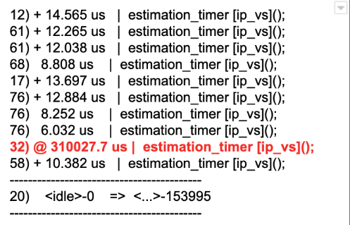

## 1. kpatch 是什么？

livepatch 实时或动态内核修补允许为正在运行的内核提供功能增强，无需重新启动系统，这对于某些在线系统修复安全漏洞非常有帮助。

Kpatch 是给 Linux 内核 livepatch 的工具，由 Redhat 公司出品。最早出现的打热补丁工具是 Ksplice。但是 Ksplice 被 Oracle 收购后，一些发行版生产商就不得不开发自己的热补丁工具，分别是 Redhat 的 Kpatch 和 Suse 的 KGraft。同时，在这两家厂商的推进下，kernel 4.0 开始，开始集成了 livepatch 技术。 Kpatch 虽然是 Redhat 研发，但其也支持 Ubuntu、Debian、Oracle Linux 等的发行版。

[**kpatch 使用限制**](https://github.com/dynup/kpatch#limitations)

livepatch 不是万能的，尤其是现在技术还不足够成熟的时候。在使用 Kpatch livepatch 存在的限制：

* 不支持修改 init 函数 (用 __init 注解) 的补丁。如果补丁试图这样做，kpatch-build 将返回一个错误。
* 不直接支持修改静态分配数据的补丁， kpatch-build 会检测到并返回错误。这个限制可以通过使用回调或影子变量来克服，如补丁作者指南中所述。
* 改变函数与动态分配数据交互方式的补丁可能是安全的，也可能不是。kpatch-build 不可能验证这种补丁的安全性。这取决于用户是否了解这个补丁的作用，新的函数与动态分配数据的交互方式是否与旧的函数不同，以及将这样的补丁原子化地应用到运行中的内核上是否安全。
* 不支持修改 vdso 函数的补丁。这些补丁在用户空间中运行，ftrace 无法钩住它们。
* 不支持修改缺少 fentry 调用的函数的补丁。这包括任何被归档到 lib.a 库中供以后链接的 lib-y 目标 (例如 lib/string.o)。

目前，kpatch 与 ftrace 和 kprobes 的使用之间存在一些不兼容的情况。更多细节请参见[常见问题部分](https://github.com/dynup/kpatch#frequently-asked-questions)。


本文将介绍在 **CentOS7.7**下安装和使用 Kpatch 软件，并用于解决我们在 kubenetes 集群中由于 service 过多导致 ipvs 中 estimation_timer 函数的内核延时过高，从而导致网络都发包抖动的问题。 该问题的完整描述可以参见[这里](eBay云计算"网"事：网络超时篇) 的第二部分，我们的排查方式类似，这里我们重点讲述修复的方式。

我们生产环境中大概存在 30000 条左右的 ipvs 规则，主机命名空间中的 estimation_timer 在内核中的遍历耗时非常高，参见下图



## 2. kpatch 样例测试

### 2.1 安装

我们的平台是 `CentOS 7.7.1908` 版本，内核版本为 `3.10.0-1062.9.1.el7.x86_64`。

```bash
$ lsb_release -a
LSB Version:	:core-4.1-amd64:core-4.1-noarch
Distributor ID:	CentOS
Description:	CentOS Linux release 7.7.1908 (Core)
Release:	7.7.1908
Codename:	Core

$ uname  -a
Linux 3.10.0-1062.9.1.el7.x86_64 #1 SMP Fri Dec 6 15:49:49 UTC 2019 x86_64 x86_64 x86_64 GNU/Linux

# 检查一下我们系统是否已经支持了 live patch
$ cat /boot/config-3.10.0-1062.9.1.el7.x86_64 |grep PATCH
CONFIG_HAVE_LIVEPATCH=y
CONFIG_LIVEPATCH=y
CONFIG_DVB_BUDGET_PATCH=m
CONFIG_SND_HDA_PATCH_LOADER=y
```

安装官方仓库给的安装文档中关于 [Fedora, RHEL, CentOS](https://github.com/dynup/kpatch#fedora-rhel-centos) 中的章节：

```bash
# 从官方拉取仓库
$ git clone https://github.com/dynup/kpatch.git
$ source test/integration/lib.sh
# 中间会使用 yum 安装相关的依赖包，安装时间视网络情况而定，在阿里云的环境下需要的时间比较长
$ sudo kpatch_dependencies

$ cd kpatch 

# 进行编译
$ make

# 默认安装到 /usr/local，需要注意 kpatch-build 在目录 /usr/local/bin/ 下，而 kpatch 在 /usr/local/sbin/ 目录
$ sudo make install

$ /usr/local/bin/kpatch-build -h
usage: kpatch-build [options] <patch1 ... patchN>
		patchN             Input patchfile(s)
		-h, --help         Show this help message
		-a, --archversion  Specify the kernel arch version
		-r, --sourcerpm    Specify kernel source RPM
		-s, --sourcedir    Specify kernel source directory
		-c, --config       Specify kernel config file
		-v, --vmlinux      Specify original vmlinux
		-j, --jobs         Specify the number of make jobs
		-t, --target       Specify custom kernel build targets
		-n, --name         Specify the name of the kpatch module
		-o, --output       Specify output folder
		-d, --debug        Enable 'xtrace' and keep scratch files
		                   in <CACHEDIR>/tmp
		                   (can be specified multiple times)
		-e, --oot-module   Enable patching out-of-tree module,
		                   specify current version of module
		--skip-cleanup     Skip post-build cleanup
		--skip-gcc-check   Skip gcc version matching check
		                   (not recommended)
```

到此 kpatch 已经安装到了系统中。舞台已经搭建完成，但是我们还需要演员登场，而演员就是我们系统运行的内核源码。

在安装过程中已经安装了内核的对应的 debug 包，内核的源码位于以下目录：

```bash
/usr/src/debug/kernel-3.10.0-1062.9.1.el7/linux-3.10.0-1062.9.1.el7.x86_64
```


### 2.2 官方样例测试

我们使用官方提供的样例程序进行简单测试：

```bash
$ cd kpatch/test/integration/rhel-7.7
$ cat meminfo-string.patch
Index: kernel/fs/proc/meminfo.c
===================================================================
--- kernel.orig/fs/proc/meminfo.c
+++ kernel/fs/proc/meminfo.c
@@ -99,7 +99,7 @@ static int meminfo_proc_show(struct seq_
 		"Committed_AS:   %8lu kB\n"
 		"VmallocTotal:   %8lu kB\n"
 		"VmallocUsed:    %8lu kB\n"
-		"VmallocChunk:   %8lu kB\n"
+		"VMALLOCCHUNK:   %8lu kB\n"
 #ifdef CONFIG_MEMORY_FAILURE
 		"HardwareCorrupted: %5lu kB\n"
 #endif
 
$sudo  /usr/local/bin/kpatch-build -t vmlinux meminfo-string.patch
ERROR: gcc/kernel version mismatch
gcc version:    GCC: (GNU) 4.8.5 20150623 (Red Hat 4.8.5-44)
kernel version: GCC: (GNU) 4.8.5 20150623 (Red Hat 4.8.5-39)
Install the matching gcc version (recommended) or use --skip-gcc-check
to skip the version matching enforcement (not recommended)
ERROR: kpatch build failed. 

# 这个报错是因为系统当前的 gcc 版本系统是 Red Hat 4.8.5-44，而 kernel version 的是 Red Hat 4.8.5-39
# 但是 gcc 的版本是一致的 4.8.5 20150623， 这里我们通过 --skip-gcc-check 跳过 gcc 检测

$ sudo /usr/local/bin/kpatch-build -t vmlinux meminfo-string.patch  --skip-gcc-check
WARNING: Skipping gcc version matching check (not recommended)
Fedora/Red Hat distribution detected
Downloading kernel source for 3.10.0-1062.9.1.el7.x86_64
ERROR: kpatch build failed. Check /root/.kpatch/build.log for more details.

# cat /root/.kpatch/build.log
Loaded plugins: auto-update-debuginfo, fastestmirror
Enabling updates-source repository
Enabling base-source repository
Enabling extras-source repository
Loading mirror speeds from cached hostfile
No Match for argument kernel-3.10.0-1062.9.1.el7
Nothing to download
```
通过日志查看，我们的得知是 kernel-3.10.0-1062.9.1.el7 的源码没有下载，通过查看源码我们发现 kpatch-build 中的下载源码逻辑为（备注：下面脚本是我提取出来，用于验证的脚本）：

```bash
#!/bin/bash
ARCHVERSION=$(uname -r)
KVER="${ARCHVERSION%%-*}"
if [[ "$ARCHVERSION" =~ - ]]; then
	KREL="${ARCHVERSION##*-}"
	KREL="${KREL%.*}"
	[[ "$KREL" =~ .el7a. ]] && ALT="-alt"
fi

yumdownloader --source "kernel$ALT-$KVER-$KREL"

# yumdownloader --source kernel-3.10.0-1062.9.1.el7
```

yumdownloader 最后执行的命令为：

```bash
# yumdownloader --source kernel-3.10.0-1062.9.1.el7，采用手工执行
$ sudo yumdownloader --source kernel-3.10.0-1062.9.1.el7
Loaded plugins: auto-update-debuginfo, fastestmirror
Enabling updates-source repository
Enabling base-source repository
Enabling extras-source repository
Loading mirror speeds from cached hostfile
No Match for argument kernel-3.10.0-1062.9.1.el7
Nothing to download
```

报错的信息与 kpatch 完全一致，搜索 kpatch 仓库发现有个 [issue #887](https://github.com/dynup/kpatch/issues/887)，解决了内核版本下载名字的问题，但是对于我们当前的问题还是没有帮助，于是决定直接手工下载源码 rpm 包。具体下载的方式参见 2.3 章节，我们从 [这里](https://vault.centos.org/7.7.1908/updates/Source/SPackages/) 下载  [kernel-3.10.0-1062.9.1.el7.src.rpm](https://vault.centos.org/7.7.1908/updates/Source/SPackages/kernel-3.10.0-1062.9.1.el7.src.rpm)。然后我们调整一下 kpatch-build 的命令格式，我们指定源码的来源  `-r kernel-3.10.0-1062.9.1.el7.src.rpm` 。

```bash
$ sudo /usr/local/bin/kpatch-build -t vmlinux meminfo-string.patch  --skip-gcc-check -r kernel-3.10.0-1062.9.1.el7.src.rpm
WARNING: Skipping gcc version matching check (not recommended)
Fedora/Red Hat distribution detected
Downloading kernel source for 3.10.0-1062.9.1.el7.x86_64
Unpacking kernel source
Testing patch file(s)
Reading special section data
Building original source
Building patched source
Extracting new and modified ELF sections
meminfo.o: changed function: meminfo_proc_show
Patched objects: vmlinux
Building patch module: livepatch-meminfo-string.ko
SUCCESS

# 编译完成后，目录下会存在一个 livepatch-meminfo-string.ko 文件，如果系统支持 livepatch 那么生成的 ko 以 livepath 开头
# 否则，则会以 kpatch 开头
$ ls -hl livepatch-meminfo-string.ko
-rw-r--r-- 1 root root 450K Dec  3 15:46 livepatch-meminfo-string.ko

# 至此为止，我们已经完成了 livepatch-meminfo-string.ko 的生成
```

在编译完成后将源代码解压到目录 `~/.kpatch/src` 中。

```bash
$ ls -hl ~/.kpatch/
total 8.0K
drwxr-xr-x 25 root root 4.0K Dec  3 17:07 src
-rw-r--r--  1 root root   27 Dec  3 17:04 version
```

通过 kpatch 命令加载生成的 ko 文件：

````bash
$ sudo /usr/local/sbin/kpatch load livepatch-meminfo-string.ko
loading patch module: livepatch-meminfo-string.ko
waiting (up to 15 seconds) for patch transition to complete...
patch transition has stalled!
signaling stalled process(es):
waiting (up to 60 seconds) for patch transition to complete...
transition complete (1 seconds)
````

这时候我们通过 dmesg 查看内核日志，可以发现以下记录：

```bash
$ dmesg -T
[Thu Dec  3 14:58:01 2020] livepatch: signaling remaining tasks
[Thu Dec  3 14:58:01 2020] livepatch: 'livepatch_ipvs_timer': patching complete
[Thu Dec  3 15:07:14 2020] livepatch: 'livepatch_ipvs_timer': starting unpatching transition
[Thu Dec  3 15:07:29 2020] livepatch: signaling remaining tasks
[Thu Dec  3 15:07:30 2020] livepatch: 'livepatch_ipvs_timer': unpatching complete
[Thu Dec  3 15:59:49 2020] livepatch: enabling patch 'livepatch_meminfo_string'
[Thu Dec  3 15:59:49 2020] livepatch: 'livepatch_meminfo_string': starting patching transition
[Thu Dec  3 16:00:04 2020] livepatch: signaling remaining tasks
[Thu Dec  3 16:00:05 2020] livepatch: 'livepatch_meminfo_string': patching complete
```

如果日志没有任何报错，则表明 livepatch 已经生效。

```bash
#-		"VmallocChunk:   %8lu kB\n"
#+		"VMALLOCCHUNK:   %8lu kB\n"
$ grep -i chunk /proc/meminfo
VMALLOCCHUNK:   34359580860 kB
```

验证 livepatch 已经生效。通过 list 命令可以参考到 livepatch 状态：

```bash
# /usr/local/sbin/kpatch list
Loaded patch modules:
livepatch_meminfo_string [enabled]

Installed patch modules:
```

我们卸载 livepatch，再次进行验证：

```bash
$ sudo /usr/local/sbin/kpatch unload livepatch-meminfo-string.ko
disabling patch module: livepatch_meminfo_string
waiting (up to 15 seconds) for patch transition to complete...
patch transition has stalled!
signaling stalled process(es):
waiting (up to 60 seconds) for patch transition to complete...
transition complete (1 seconds)
unloading patch module: livepatch_meminfo_string
```

通过 list 命令检查，这时候可以验证 livepatch 已经卸载。

```bash
$ sudo /usr/local/sbin/kpatch list
Loaded patch modules:

Installed patch modules:

$ grep -i chunk /proc/meminfo
VmallocChunk:   34359580860 kB
```

如果担心 livepatch 会在机器重启失效，那么可以使用 kpatch install 的命令安装，可以保证下次重新启动的时候能够生效。

kpatch 的使用命令详情如下：

```bash
 /usr/local/sbin/kpatch -h
usage: kpatch <command> [<args>]

Valid commands:
   install [-k|--kernel-version=<kernel version>] <module>
      install patch module to be loaded at boot
   uninstall [-k|--kernel-version=<kernel version>] <module>
      uninstall patch module

   load --all
      load all installed patch modules into the running kernel
   load <module>
      load patch module into the running kernel
   unload --all
      unload all patch modules from the running kernel
   unload <module>
      unload patch module from the running kernel

   info <module>
      show information about a patch module

   list
      list installed patch modules

   signal
      signal/poke any process stalling the current patch transition

   version
      display the kpatch version
```


### 2.3 安装 CentOS 系统源码

CentOS 内核的安装参见：[我需要内核的源代码](https://wiki.centos.org/zh/HowTos/I_need_the_Kernel_Source?highlight=%28kernel%29%7C%28src%29)，大多数场景下只需要 header 文件即可，但是我们是要修改源码并进行重新编译，因此需要下载完整的源码 rpm。按照文档的提示，源码目录格式为：

> http://vault.centos.org/7.N.YYMM/os/Source/SPackages/
> http://vault.centos.org/7.N.YYMM/updates/Source/SPackages/

我们系统版本为 `CentOS 7.7.1908`，因此下载安装包的目录为

* [http://vault.centos.org/7.7.1908/os/Source/SPackages/](http://vault.centos.org/7.7.1908/os/Source/SPackages/)

  这个目录主要是系统中各种安装组件的源代码，比如 [GeoIP-1.5.0-13.el7.src.rpm](https://vault.centos.org/7.7.1908/os/Source/SPackages/GeoIP-1.5.0-13.el7.src.rpm)。

* [http://vault.centos.org/7.7.1908/updates/Source/SPackages/](http://vault.centos.org/7.7.1908/updates/Source/SPackages/)

  该目录包含内核源码的 rpm 包，比如 [kernel-3.10.0-1062.9.1.el7.src.rpm](https://vault.centos.org/7.7.1908/updates/Source/SPackages/kernel-3.10.0-1062.9.1.el7.src.rpm)。系统还存在一个 [kernel-3.10.0-1062.9.1.el7.centos.plus.src.rpm](https://vault.centos.org/7.7.1908/updates/Source/SPackages/kernel-3.10.0-1062.9.1.el7.centos.plus.src.rpm)，具体区别还等待进一步研究。


## 3.  实战 ipvs estimation_timer 的延时问题

将下载的 rpm.src 解压：

```bash
$ rpm2cpio kernel-3.10.0-1062.9.1.el7.src.rpm |cpio -div 
$ xz -d linux-3.10.0-1062.9.1.el7.tar.xz 
$ tar -xvf linux-3.10.0-1062.9.1.el7.tar
$ cp -ra linux-3.10.0-1062.9.1.el7/ linux-3.10.0-1062.9.1.el7-patch
```


### 3.1 第一版，设置为空函数

[`estimation_timer`](https://elixir.bootlin.com/linux/v3.10.108/source/net/netfilter/ipvs/ip_vs_est.c#L92) 函数位于 `net/netfilter/ipvs/ip_vs_est.c` 文件中，函数声明如下：

```c
static void estimation_timer(unsigned long arg)
{
	struct ip_vs_estimator *e;
	struct ip_vs_stats *s;
	u32 n_conns;
	u32 n_inpkts, n_outpkts;
	u64 n_inbytes, n_outbytes;
	u32 rate;
	struct net *net = (struct net *)arg;
	struct netns_ipvs *ipvs;

	ipvs = net_ipvs(net);
	spin_lock(&ipvs->est_lock);
	list_for_each_entry(e, &ipvs->est_list, list) {  // 因为遍历的条目不固定，在条目多的时候引起延时过高
		s = container_of(e, struct ip_vs_stats, est);

		spin_lock(&s->lock);
		ip_vs_read_cpu_stats(&s->ustats, s->cpustats);
    
    // ...
	}
	spin_unlock(&ipvs->est_lock);
	mod_timer(&ipvs->est_timer, jiffies + 2*HZ); // 每 2s 启动启动一次
}
```

如何修改这个函数可以快速达到我们的效果，我的第一直觉是把这个函数完全清空，这样比较容易实现：

```c
static void estimation_timer(unsigned long arg)
{
    return;
}
```

生成我们第一份的 patch 

```bash
$ diff -u linux-3.10.0-1062.9.1.el7/net/netfilter/ipvs/ip_vs_est.c linux-3.10.0-1062.9.1.el7-patch/net/netfilter/ipvs/ip_vs_est.c > ip_vs_timer_v1.patch
$ cat ip_vs_timer_v1.patch
--- linux-3.10.0-1062.9.1.el7/net/netfilter/ipvs/ip_vs_est.c	2019-12-02 21:08:40.000000000 +0800
+++ linux-3.10.0-1062.9.1.el7-patch/net/netfilter/ipvs/ip_vs_est.c	2020-12-03 18:07:53.206490443 +0800
@@ -91,52 +91,7 @@

 static void estimation_timer(unsigned long arg)
 {
-	struct ip_vs_estimator *e;
-	struct ip_vs_stats *s;
-	u32 n_conns;
-	u32 n_inpkts, n_outpkts;
-	u64 n_inbytes, n_outbytes;
-	u32 rate;
-	struct net *net = (struct net *)arg;
-	struct netns_ipvs *ipvs;
-
-	ipvs = net_ipvs(net);
-	spin_lock(&ipvs->est_lock);
-	list_for_each_entry(e, &ipvs->est_list, list) {
-		s = container_of(e, struct ip_vs_stats, est);
-
-		spin_lock(&s->lock);
-		ip_vs_read_cpu_stats(&s->ustats, s->cpustats);
....
-		spin_unlock(&s->lock);
-	}
-	spin_unlock(&ipvs->est_lock);
-	mod_timer(&ipvs->est_timer, jiffies + 2*HZ);
+	return;
 }

 void ip_vs_start_estimator(struct net *net, struct ip_vs_stats *stats)
```

将 patch 文件复制到我们制定目录后，进行验证：

```bash
$ sudo /usr/local/bin/kpatch-build ip_vs_timer_v1.patch --skip-gcc-check --skip-cleanup -r /root/kernel-3.10.0-1062.9.1.el7.src.rpm
WARNING: Skipping gcc version matching check (not recommended)
Skipping cleanup
Using cache at /root/.kpatch/src
Testing patch file(s)
Reading special section data
Building original source
Building patched source
ERROR: kpatch build failed. Check /root/.kpatch/build.log for more details

$ cat /root/.kpatch/build.log
...
net/netfilter/ipvs/ip_vs_est.c:58:13: error: ‘ip_vs_read_cpu_stats’ defined but not used [-Werror=unused-function]
 static void ip_vs_read_cpu_stats(struct ip_vs_stats_user *sum,
             ^
cc1: all warnings being treated as errors
make[3]: *** [net/netfilter/ipvs/ip_vs_est.o] Error 1
make[2]: *** [net/netfilter/ipvs] Error 2
make[1]: *** [net/netfilter] Error 2
make: *** [net] Error 2
make: *** Waiting for unfinished jobs....
```

这是因为我们修改了注释函数 `estimation_timer` 中的所有调用，导致这个函数定义的函数 `ip_vs_read_cpu_stats` 没有了调用方。

> 如果 /usr/local/bin/kpatch-build 添加了 --skip-cleanup 选项，则不会清理缓存，下次在进行 patch 的时候，会使用缓存目录 /root/.kpatch/src 中已经 patch 过的源代码，所以会导致 patch 的时候出错：
>
> ```bash
> $ cat /root/.kpatch/build.log
> checking file net/netfilter/ipvs/ip_vs_est.c
> Reversed (or previously applied) patch detected!  Skipping patch.
> 1 out of 1 hunk ignored
> ```
>
> 解决的方式是将 patch 过程中的出错的文件 net/netfilter/ipvs/ip_vs_est.c 还原成未执行 patch 的文件。
>
> ```bash
> $ cp linux-3.10.0-1062.9.1.el7/net/netfilter/ipvs/ip_vs_est.c /root/.kpatch/src/net/netfilter/ipvs/ip_vs_est.c
> cp: overwrite ‘/root/.kpatch/src/net/netfilter/ipvs/ip_vs_est.c’? y
> ```
>
> 
>
> 该问题需要验证是否有其他方式规避。


### 3.2 第二版，注释掉定时器设置

生成第二份 patch

```bash
# cat ip_vs_timer_v2.patch
--- linux-3.10.0-1062.9.1.el7/net/netfilter/ipvs/ip_vs_est.c	2019-12-02 21:08:40.000000000 +0800
+++ linux-3.10.0-1062.9.1.el7-patch/net/netfilter/ipvs/ip_vs_est.c	2020-12-03 18:48:45.245063479 +0800
@@ -136,7 +136,10 @@
 		spin_unlock(&s->lock);
 	}
 	spin_unlock(&ipvs->est_lock);
-	mod_timer(&ipvs->est_timer, jiffies + 2*HZ);
+	/* delete timer */
+	/* mod_timer(&ipvs->est_timer, jiffies + 2*HZ); */
+	printk("hotfix estimation_timer patched\n");
+
 }

 void ip_vs_start_estimator(struct net *net, struct ip_vs_stats *stats)
```


继续编译生成：

```bash
$ sudo /usr/local/bin/kpatch-build ip_vs_timer_v2.patch --skip-gcc-check --skip-cleanup -r /root/kernel-3.10.0-1062.9.1.el7.src.rpm
WARNING: Skipping gcc version matching check (not recommended)
Skipping cleanup
Using cache at /root/.kpatch/src
Testing patch file(s)
Reading special section data
Building original source
Building patched source
Extracting new and modified ELF sections
ip_vs_est.o: changed function: estimation_timer
Patched objects: net/netfilter/ipvs/ip_vs.ko
Building patch module: livepatch-ip_vs_timer_v2.ko
SUCCESS

$ ls -hl livepatch-ip_vs_timer_v2.ko
-rw-r--r-- 1 root root 586K Dec  3 18:53 livepatch-ip_vs_timer_v2.ko
```

在 patch 前我们先使用 [perf-tools](https://github.com/brendangregg/perf-tools) 的 funcgraph 工具来验证是否 ip_vs 模块中 estimation_timer 的函数调用层级和耗时：

```
# ./funcgraph  estimation_timer
Tracing "estimation_timer"... Ctrl-C to end.
  0)               |  estimation_timer [ip_vs]() {
  0)   0.234 us    |    _raw_spin_lock();
  0)   0.399 us    |    _raw_spin_lock();
  					...
  0)               |    mod_timer() {
  0)               |      lock_timer_base.isra.37() {
  0)   0.202 us    |        _raw_spin_lock_irqsave();
  0)   0.566 us    |      }
  0)   0.044 us    |      detach_if_pending();
  0)   0.599 us    |      get_nohz_timer_target();
  0)               |      internal_add_timer() {
  0)   0.213 us    |        __internal_add_timer();
  0)   0.053 us    |        wake_up_nohz_cpu();
  0)   0.994 us    |      }
  0)   0.072 us    |      _raw_spin_unlock_irqrestore();
  0)   4.105 us    |    }
  0) ! 345.402 us  |  }
```

我们使用 nm 查看 livepatch-ip_vs_timer_v2.ko 文件的符号表：

```bash
# nm livepatch-ip_vs_timer_v2.ko|grep estimation_timer
0000000000000000 t estimation_timer
```

使用 kpatch 加载 ko 模块

```bash
$ sudo /usr/local/sbin/kpatch load livepatch-ip_vs_timer_v2.ko
loading patch module: livepatch-ip_vs_timer_v2.ko
waiting (up to 15 seconds) for patch transition to complete...
patch transition has stalled!
signaling stalled process(es):
waiting (up to 60 seconds) for patch transition to complete...
transition complete (1 seconds)
```

查看内核日志

```bash
$ dmesg -T
[Thu Dec  3 19:50:50 2020] livepatch: enabling patch 'livepatch_ip_vs_timer_v2'
[Thu Dec  3 19:50:50 2020] livepatch: 'livepatch_ip_vs_timer_v2': starting patching transition
[Thu Dec  3 19:50:50 2020] hotfix estimation_timer patched
```

`hotfix estimation_timer patched` 正是我们 v2 版本函数替换的打印，表明我们已经使用我们定义的函数完成了 ipvs 模块对应函数的替换。

```bash
# grep estimation_timer /proc/kallsyms
ffffffffc06561c0 t estimation_timer	[livepatch_ip_vs_timer_v2]
ffffffffc0511cf0 t estimation_timer	[ip_vs]
```

我们再次使用 perf_tools 中的工具 funcgraph 验证：

```bash
$ sudo ./funcgraph estimation_timer -d 20
Tracing "estimation_timer"... Ctrl-C to end.
^C
Ending tracing.
```

通过我们的 livepatch 成功修订了 estimation_timer 的调用，一切看起来很成功。

验证完成后，unload 掉 livepatch，我们期望是能够正常恢复 estimation_timer 的统计，但是采用 funcgraph 工具查看，却迟迟看不到 

estimation_timer 的踪影，如果我们对 estimation_timer 的修改还有印象的话，那么一定还会记着，我们在函数尾部注销每次 2s 启动的逻辑，通过我们自己的函数替换，导致了我们模块卸载以后，也没有定时器来触发原有 ipvs 模块中的 estimation_timer 函数。尽管我们实现了期望的功能，但是在回滚后却中断了原有的业务逻辑功能，这在生产环境中是存在风险了，那么我们如何修改才能够实现可替换、可回滚呢？ 

如果我们能够容忍一定时间的延时，降低该函数带来的影响，我们可以把函数的触发周期从 2s 调整成我们可以接受的时间内，比如 5分钟，这样如果我们 livepatch 卸载以后，最多 5 分钟就可以实现功能恢复至原有逻辑，一定程度也是可以接受的。


### 3.3 第三版，只是修改定时器时长

```c
mod_timer(&ipvs->est_timer, jiffies + 300*HZ); // 2s -> 5min
```

整个验证过程同上，省略。

estimation_timer 函数的缺失，理论是影响了 ipvs 中 RS 的统计，如下：

```bash
# ipvsadm -Ln --stats|grep "10.85.0.1:443" -A 3
TCP  10.85.0.1:443                      15     1044     1003   125874  1163064
  -> 172.16.132.179:6443                 5      579      592    55305  1007040
  -> 172.16.133.23:6443                  5       96       99    13676    57537
  -> 172.16.134.72:6443                  5      369      312    56893    98487

```

如果定时器停止运转，那么上述的统计数据则不再更新。


## 4. 参考

* [kpatch](https://github.com/dynup/kpatch)
* [如何替换一个Linux内核函数的实现-热补丁原理](https://blog.csdn.net/dog250/article/details/105254739)
* [内核补丁热更新ceph内核模块](https://www.cnblogs.com/zphj1987/p/14006711.html)
* [An overview of kpatch-build](http://bitboom.github.io/kpatch-build-internal)