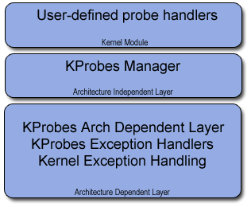
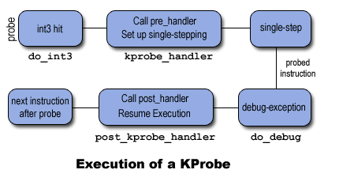

# KProbe 原理解析-1

[TOC]

## 1. 介绍

KProbes 是Linux 内核的调试机制，可以动态注入跟踪代码，用于排查性能瓶颈、记录特定事件、跟踪问题等。最早 KProbes 由 IBM 开发，作为高级别的跟踪工具 DProbes 的底层机制。DProbes 增加了许多新的功能，包括它自己的脚本语言，用于编写探针处理程序。然而，只有 KProbes 被合并到了内核中。

KProbes 的实现在很大程度上依赖于处理器架构的特性，架构不同，底层机制亦不同。本文讨论只与 x86 架构有关，假设读者对 x86 架构的中断和异常处理有一定的了解。当然，KProbes 也可以在mips、sparc64、arm64 等架构上使用。

内核探针（kernel probe）是放置在某个指令地址上的一组处理程序。目前内核中的探针主要实现为： KProbes 和  KRetprobe。KProbes 几乎可以被插入到内核函数的任何指令位置运行（除了带有 __kprobes/nokprobe_inline 注解的函数和标有 NOKPROBE_SYMBOL 的函数之外），而 KRetprobes 则是在指定的内核函数返回时才被执行。

>  /sys/kernel/debug/kprobes/blacklist 为禁止 kprobe 的函数列表；/proc/kallsyms 系统导出的全部函数地址和列表

>  早期的版本中还有 JProbes，只能被插入到一个内核函数的入口，用于跟踪函数访问，由于 KProbes 已经满足了所有功能，  JProbes 2018 年已经被作者移除，本文不再介绍。

一个 KProbe 由一个前置处理程序 pre_handler 和一个事后处理程序 post-handler 组成。当一个 KProbe 被安装在某条指令处后，当该指令被执行时，pre_handler 就在探测点执行之前被执行。同样，后处理程序 post-handler 是在探测点执行后被执行。

下图描述了 KProbes 的架构，处理探针的部分与架构有关。在x86上，KProbes 利用了异常处理机制，并为此修改了标准的断点、调试和其他一些异常处理程序。探针的大部分处理都是在断点和调试异常处理程序的上下文中完成的，这些异常处理程序构成了 KProbes 架构依赖层。KProbes 管理器 是 KProbes 架构中的独立层 ，用于注册和取消注册探针。用户可以在内核模块中提供探针处理程序，通过 KProbes 管理器注册探针。



KProbe 的实现利用了 CPU 的两个异常机制：断点异常和单步异常。

KProbe 把探测点的指令替换成断点指令 BREAKPOINT，执行到探测点以后，系统会陷入断点异常指令（x86 上的 int3），将程序控制转移至断点处理程序 do_int3()（ arch/x86/kernel/traps.c ）。do_int3() 是通过中断门（ interrupt gate）调用的，因此当控制到达那里时，中断是被禁止的。do_int3() 处理程序通知 KProbes 发生了断点，KProbes检查断点是否由 KProbes 的注册函数设置。如果在探针被击中的地址上没有探针存在，它就简单地返回 0。否则将继续调用注册的 pre_handler 函数，然后把 CPU 设置为单步模式继续执行探测点原有的指令，原有指令执行完成以后又会陷入单步异常 int1，在 int1 中调用 post_handler，并恢复单步模式到正常模式，然后返回继续执行探测点后续的指令。

所以理解 int3 和 int1 的异常处理流程是理解 KProbe 实现原理的关键。

- KProbe的注册流程为：备份探测点原有的指令代码，把 probe 结构加入处理链表，替换探测点的指令为断点指令 0xcc。
- KProbe 的执行过程为：执行到探测点的断点指令陷入 int3 异常处理，在int3 中找到探测点地址对应的 kprobe 结构，执行 pre_handler 函数，执行完以后将 CPU 的标志设置为单步模式，在单步模式下执行备份的探测点原指令，执行完单步指令后陷入 int1 异常，在 int1 的梳理函数 do_debug 中继续调用 post_handler，并恢复单步模式到正常模式，然后返回继续执行探测点后续的指令。



KRetprobe 也使用了 KProbes 来实现，当用户调用 register_kretprobe() 时，KProbe 在被探测函数的入口建立了一个探测点，当执行到探测点时，KProbe 保存了被探测函数的返回地址并取代返回地址为一个 trampoline 的地址，KProbe 在初始化时定义了该 trampoline 并且为该 trampoline 注册了一个 kprobe，当被探测函数执行它的返回指令时，控制传递到该 trampoline，因此 KProbe 已经注册的对应于 trampoline 的处理函数将被执行，而该处理函数会调用用户关联到该 KRetprobe 上的处理函数，处理完毕后，设置指令寄存器指向已经备份的函数返回地址，因而原来的函数返回被正常执行。

关于 KProbes 注意事项：

- KProbes 允许在同一地址注册多个 KProbe。
- 带有 __kprobes/nokprobe_inline 注解的函数和标有 NOKPROBE_SYMBOL 的函数 register_probe 将返回-EINVAL。
- 如果为一个内联 (inline) 函数注册探测点，KProbes 无法保证对该函数的所有实例都注册探测点，因为 GCC 可能隐式地内联一个函数。因此，要记住，用户可能看不到预期的探测点的执行。
- 一个探测点处理函数能够修改被探测函数的上下文，如修改内核数据结构，寄存器等。因此，KProbes 可以用来安装 Bug 解决代码或注入一些错误或测试代码。
- 如果一个探测处理函数调用了另一个探测点，该探测点的处理函数不将运行，但是它的 nmissed 数将加 1。多个探测点处理函数或同一处理函数的多个实例能够在不同的 CPU 上同时运行。
- 除了注册和卸载，KProbes 不会使用 mutexe 或分配内存。
- 探测点处理函数在运行时是失效抢占的，依赖于特定的架构，探测点处理函数运行时也可能是中断失效的。因此，对于任何探测点处理函数，不要使用导致睡眠或进程调度的任何内核函数（如尝试获得 semaphore)。
- KRetprobe 是通过取代返回地址为预定义的 trampoline 的地址来实现的，因此栈回溯和 GCC 内嵌函数__builtin_return_address() 调用将返回 trampoline 的地址而不是真正的被探测函数的返回地址。
- 如果一个函数的调用次数与它的返回次数不相同，那么在该函数上注册的 KRetprobe 探测点可能产生无法预料的结果（ do_exit()就是一个典型的例子，但 do_execve() 和 do_fork() 没有问题）。
- 当进入或退出一个函数时，如果 CPU 正运行在一个非当前任务所有的栈上，那么该函数的 KRetprobe 探测可能产生无法预料的结果，因此 KProbes 并不支持在 x86_64 上对 __switch_to() 的返回探测，如果用户对它注册探测点，注册函数将返回 -EINVAL。

## 2. 前端使用

KProbes 的使用可以有以下三种方式：

* 编写内核模块 kernel module，在合适的时机（比如在内核模块注册的时候）调用 `register_kprobe` 函数进行注册，并在使用完成后（比如模块卸载的时候）调用 `unregister_kprobe` 删除注册的函数；具体的样例可以参考 [Kernel debugging with Kprobes](https://www.ibm.com/developerworks/library/l-kprobes/index.html) 。
* 通过基于 Ftrace 的机制，通过文件 `/sys/kernel/debug/tracing/kprobe_events`，可以通过修改该文件的内容来启用、禁用和设置打印消息的格式；具体文章可参考内核中相关文档 [Kprobe-based Event Tracing](https://www.kernel.org/doc/html/latest/trace/kprobetrace.html)。
* `perf_event_open()` perf (1) 和基于 BPF 的追踪技术；相关资料可以参考：[Linux Perf Tools - Probe & Trace](http://vger.kernel.org/~acme/perf-devconf-2015.pdf)。

### 2.1 内核模块

完整代码参考 [kprobe_ko_ex](./kprobe_ko_ex)

```c
#include <linux/kernel.h>
#include <linux/module.h>
#include <linux/kprobes.h>

#define MAX_SYMBOL_LEN	64
static char symbol[MAX_SYMBOL_LEN] = "_do_fork";
module_param_string(symbol, symbol, sizeof(symbol), 0644);

/* For each probe you need to allocate a kprobe structure */
static struct kprobe kp = {
	.symbol_name	= symbol,
};

/* kprobe pre_handler: called just before the probed instruction is executed */
static int handler_pre(struct kprobe *p, struct pt_regs *regs)
{
#ifdef CONFIG_X86
	pr_info("<%s> pre_handler: p->addr = 0x%p, ip = %lx, flags = 0x%lx\n",
		p->symbol_name, p->addr, regs->ip, regs->flags);
#endif
	
  // 其他省略

	/* A dump_stack() here will give a stack backtrace */
	return 0;
}

/* kprobe post_handler: called after the probed instruction is executed */
static void handler_post(struct kprobe *p, struct pt_regs *regs,
				unsigned long flags)
{
#ifdef CONFIG_X86
	pr_info("<%s> post_handler: p->addr = 0x%p, flags = 0x%lx\n",
		p->symbol_name, p->addr, regs->flags);
#endif
	
  // 其他省略
}

/*
 * fault_handler: this is called if an exception is generated for any
 * instruction within the pre- or post-handler, or when Kprobes
 * single-steps the probed instruction.
 */
static int handler_fault(struct kprobe *p, struct pt_regs *regs, int trapnr)
{
	pr_info("fault_handler: p->addr = 0x%p, trap #%dn", p->addr, trapnr);
	/* Return 0 because we don't handle the fault. */
	return 0;
}

static int __init kprobe_init(void)
{
	int ret;
	kp.pre_handler = handler_pre;
	kp.post_handler = handler_post;
	kp.fault_handler = handler_fault;

	ret = register_kprobe(&kp);
	if (ret < 0) {
		pr_err("register_kprobe failed, returned %d\n", ret);
		return ret;
	}
	pr_info("Planted kprobe at %p\n", kp.addr);
	return 0;
}

static void __exit kprobe_exit(void)
{
	unregister_kprobe(&kp);
	pr_info("kprobe at %p unregistered\n", kp.addr);
}

module_init(kprobe_init)
module_exit(kprobe_exit)
MODULE_LICENSE("GPL");
```

Makefile

```makefile
obj-m := kprobe_example.o

KERNELBUILD :=/lib/modules/$(shell uname -r)/build

default:
	make -C $(KERNELBUILD)  M=$(shell pwd) modules
clean:
	rm -rf *.o *.ko *.mod.c .*.cmd *.markers *.order *.symvers .tmp_versions
```

编译并加载测试：

```bash
# make
# inmod kprobe_example
# dmesg
[26537.263371] kprobe_example: loading out-of-tree module taints kernel.
[26537.264006] kprobe_example: module verification failed: signature and/or required key missing - tainting kernel
[26537.272969] <_do_fork> pre_handler: p->addr = 0x000000001f2d23bd, ip = ffffffff85eb02c1, flags = 0x246
[26537.273726] Planted kprobe at 000000001f2d23bd
[26537.273969] <_do_fork> pre_handler: p->addr = 0x000000001f2d23bd, ip = ffffffff85eb02c1, flags = 0x246
[26537.274031] <_do_fork> post_handler: p->addr = 0x000000001f2d23bd, flags = 0x246
[26537.274651] <_do_fork> post_handler: p->addr = 0x000000001f2d23bd, flags = 0x246
[26540.939990] <_do_fork> pre_handler: p->addr = 0x000000001f2d23bd, ip = ffffffff85eb02c1, flags = 0x246
[26540.941180] <_do_fork> post_handler: p->addr = 0x000000001f2d23bd, flags = 0x246
[26599.846569] kprobe at 000000001f2d23bd unregistered

# rmmod kprobe_example
```


### 2.2 Ftrace  KProbe

需要内核编译支持 CONFIG_KPROBE_EVENTS=y，一般发行版本都已经默认支持。

* 定义探针事件
  ```bash
  # echo 'p:myprobe do_sys_open dfd=%ax filename=%dx flags=%cx mode=+4($stack)' > /sys/kernel/debug/tracing/kprobe_events
  ```
这将在 do_sys_open() 函数的入口处设置一个 kprobe，并将第 1 至 4 个参数记录为 "myprobe " 事件。注意，哪个寄存器/堆栈条目被分配给每个函数参数取决于特定的拱形文件 ABI。如果你不确定 ABI，请尝试使用 perf-tools 的 probe 子命令（你可以在 tools/perf/下找到它）。如本例所示，用户可以为每个参数选择更熟悉的名称。
  
  > yum install -y kernel-debug.x86_64
  
  `kprobe_events` 的更加详细的格式参见 [Synopsis of kprobe_events](https://www.kernel.org/doc/html/latest/trace/kprobetrace.html#synopsis-of-kprobe-events)。
  
  ```bash
  # echo 'r:myretprobe do_sys_open $retval' >> /sys/kernel/debug/tracing/kprobe_events
  ```
  
  这将在 do_sys_open() 函数的返回点上设置一个 kretprobe，并将返回值记录为 "myretprobe " 事件。你可以通过 `/sys/kernel/debug/tracing/events/kprobes/<EVENT>/format` 查看这些事件的格式。
  
  ```bash
  # cat  /sys/kernel/debug/tracing/kprobe_events
  p:kprobes/myprobe do_sys_open dfd=%ax filename=%dx flags=%cx mode=+4($stack)
  r:kprobes/myretprobe do_sys_open arg1=$retval
  
  # cat /sys/kernel/debug/tracing/events/kprobes/myprobe/format
  name: myprobe
  ID: 780
  format:
          field:unsigned short common_type;       offset:0;       size:2; signed:0;
          field:unsigned char common_flags;       offset:2;       size:1; signed:0;
          field:unsigned char common_preempt_count;       offset:3; size:1;signed:0;
          field:int common_pid;   offset:4;       size:4; signed:1;
  
          field:unsigned long __probe_ip; offset:12;      size:4; signed:0;
          field:int __probe_nargs;        offset:16;      size:4; signed:1;
          field:unsigned long dfd;        offset:20;      size:4; signed:0;
          field:unsigned long filename;   offset:24;      size:4; signed:0;
          field:unsigned long flags;      offset:28;      size:4; signed:0;
          field:unsigned long mode;       offset:32;      size:4; signed:0;
  
  
  print fmt: "(%lx) dfd=%lx filename=%lx flags=%lx mode=%lx", REC->__probe_ip,
  REC->dfd, REC->filename, REC->flags, REC->mode
  ```
  
  在测试完成后，我们可以使用 `echo > /sys/kernel/debug/tracing/kprobe_events` 清理全部的探针点；
  
  或者我们可以有选择性的进行清除：
  
  ```bash
  # echo -:myprobe >> kprobe_events
  ```
  
* 启用探针事件

  在探针设置以后，默认是被禁用的，通过以下命令显示进行启用

  ```bash
  # echo 1 > /sys/kernel/debug/tracing/events/kprobes/myprobe/enable
  # echo 1 > /sys/kernel/debug/tracing/events/kprobes/myretprobe/enable
  ```

* 查看探针事件

  ```bash
  # 开启 tracing 
  # echo 1 > /sys/kernel/debug/tracing/tracing_on
  Open something...
  
  # 关闭 tracing
  # echo 0 >  /sys/kernel/debug/tracing/tracing_on
  
  cat /sys/kernel/debug/tracing/trace
  # tracer: nop
  #
  #           TASK-PID    CPU#    TIMESTAMP  FUNCTION
  #              | |       |          |         |
             <...>-1447  [001] 1038282.286875: myprobe: (do_sys_open+0x0/0xd6) dfd=3 filename=7fffd1ec4440 flags=8000 mode=0
             <...>-1447  [001] 1038282.286878: myretprobe: (sys_openat+0xc/0xe <- do_sys_open) $retval=fffffffffffffffe
             <...>-1447  [001] 1038282.286885: myprobe: (do_sys_open+0x0/0xd6) dfd=ffffff9c filename=40413c flags=8000 mode=1b6
             <...>-1447  [001] 1038282.286915: myretprobe: (sys_open+0x1b/0x1d <- do_sys_open) $retval=3
             <...>-1447  [001] 1038282.286969: myprobe: (do_sys_open+0x0/0xd6) dfd=ffffff9c filename=4041c6 flags=98800 mode=10
             <...>-1447  [001] 1038282.286976: myretprobe: (sys_open+0x1b/0x1d <- do_sys_open) $retval=3
  ```


* 关闭和删除

  ```bash
  # echo 0 > /sys/kernel/debug/tracing/events/kprobes/myprobe/enable
  # echo 0 > /sys/kernel/debug/tracing/events/kprobes/myretprobe/enable
  
  # 如果不通过上述命令 echo 0 进行关闭，删除的时候回报错 Failed to delete event: Device or resource busy
  # echo nop > /sys/kernel/debug/tracing/kprobe_events
  ```

  

### 2.3 Perf && BPF 

#### Perf

```bash
# 需要内核的调试信息的支持  DWARF & GCC -pg
# perf probe -L vfs_open
# perf probe 'vfs_open'
Added new event:
  probe:vfs_open       (on vfs_open)

You can now use it in all perf tools, such as:

	perf record -e probe:vfs_open -aR sleep 1
	
	 -R, --raw-samples 
	 -a, --all-cpus
	
# perf probe --list
  probe:vfs_open       (on vfs_open)
  
# perf record -e probe:vfs_open -aR --call-graph dwarf sleep 5
[ perf record: Woken up 1 times to write data ]
[ perf record: Captured and wrote 0.209 MB perf.data (29 samples) ]


# perf report
-  100.00%   100.00%  (ffffffff860c3cd0)      
   - 45.16% 0x56244fb4db2d                    
        __libc_start_main                     
        0x56244fb4d87f                        
        __GI_setlocale (inlined)              
      - _nl_find_locale                       
         - 38.71% _nl_load_locale             
              __GI___open64_nocancel (inlined)
              entry_SYSCALL_64_after_hwframe  
              do_syscall_64                   
              do_sys_open                     
              do_filp_open                    
              path_openat                     
              vfs_open

# perf probe -d vfs_open

# perf probe icmp_rcv
# perf record -e probe:icmp_rcv --call-graph dwarf ping -b 127.255.255.255
```

#### BPF

`vfsstat` 用于统计 vfs 系统的对应事件。

```bash
# /usr/share/bcc/tools/vfsstat
TIME         READ/s  WRITE/s  FSYNC/s   OPEN/s CREATE/s
18:15:22:       212      401        0        3        0
18:15:23:       172      338        0        0        0
18:15:24:       128      249        0        0        0
18:15:25:       123      242        0        0        0
18:15:26:       175      347        0        0        0
```

对于 vfs 事件的统计底层实现正是基于 KProbe，完整代码参见 [vfsstat.py](https://github.com/iovisor/bcc/blob/master/tools/vfsstat.py)。

```python
b.attach_kprobe(event="vfs_read", fn_name="do_read")
b.attach_kprobe(event="vfs_write", fn_name="do_write")
b.attach_kprobe(event="vfs_fsync", fn_name="do_fsync")
b.attach_kprobe(event="vfs_open", fn_name="do_open")
b.attach_kprobe(event="vfs_create", fn_name="do_create")
```

在分析了 KProbes 的基础知识和使用的场景，后续我们将从源码层面介绍 KProbe 的实现。

## 参考

* [Documentation/kprobes.txt](https://www.kernel.org/doc/Documentation/kprobes.txt)
* [An introduction to KProbes](https://lwn.net/Articles/132196/)
* [kprobes tutorial](https://www.kernel.org/doc/ols/2006/slides/kprobes.html)
* [Kernel debugging with Kprobes](https://www.ibm.com/developerworks/library/l-kprobes/index.html) 
* [Linux 下的一个全新的性能测量和调式诊断工具 Systemtap，第 1 部分: kprobe](http://www.ibm.com/developerworks/cn/linux/l-cn-systemtap1)
* [Kprobe-based Event Tracing](https://www.kernel.org/doc/html/latest/trace/kprobetrace.html) [中文](https://blog.csdn.net/pwl999/article/details/80431344) 
* [Kernel Tracing with Ftrace](https://blog.selectel.com/kernel-tracing-ftrace/) [中文](https://zhuanlan.zhihu.com/p/39788032)
* CentOS 调试 vmlinux  http://debuginfo.centos.org/8/x86_64/Packages/
  * [ kernel-debug-debuginfo-4.18.0-193.14.2.el8_2.x86_64.rpm](http://debuginfo.centos.org/8/x86_64/Packages/kernel-debug-debuginfo-4.18.0-193.14.2.el8_2.x86_64.rpm)
  * [kernel-debuginfo-common-x86_64-4.18.0-193.14.2.el8_2.x86_64.rpm](http://debuginfo.centos.org/8/x86_64/Packages/kernel-debuginfo-common-x86_64-4.18.0-193.14.2.el8_2.x86_64.rpm)
* https://blog.linuxplumbersconf.org/2014/ocw/system/presentations/1773/original/ftrace-kernel-hooks-2014.pdf

